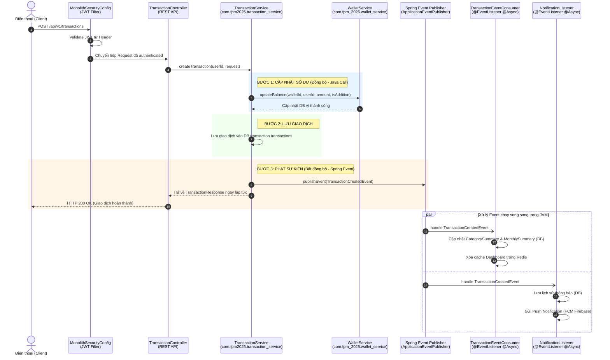

# 🏛️ Tổng Quan Kiến Trúc FPM Monolith (FPM-2025)

Tài liệu này phân tích chi tiết về mặt kiến trúc hệ thống sau khi chuyển đổi (migration) toàn bộ hệ thống từ mô hình **Microservices** sang mô hình **Monolith** (Đơn khối) trong module `fpm-monolith`.

---

## 1. Bản Chất của Sự Chuyển Đổi (Microservices vs. Monolith)

Trước đây, hệ thống **Family Pocket Manager (FPM) 2025** được thiết kế dựa trên kiến trúc Microservices gồm nhiều thành phần độc lập:
*   **Infrastructure**: `eureka-server`, `api-gateway`, `config-server`.
*   **Core Services**: `user-auth-service`, `wallet-service`, `transaction-service`, `reporting-service`, `notification-service`.
*   **High-Tech Services**: `ocr-service`, `ai-service`.
*   **Communication**: API Gateway (REST), gRPC (Nội bộ đồng bộ), Kafka (Bất đồng bộ thông lượng cao), RabbitMQ (Task queue, retry).
*   **Databases**: Mỗi service sử dụng một cơ sở dữ liệu MySQL riêng biệt (`user_auth_db`, `wallet_db`, `transaction_db`, `reporting_db`, `notification_db`).

### Sự Thay Đổi Lớn Trong `fpm-monolith`:
Trong `fpm-monolith`, toàn bộ mã nguồn của 7 services nghiệp vụ đã được gom về **một Spring Boot Application duy nhất** chạy trong cùng một tiến trình JVM. Điều này mang lại những ưu điểm vượt trội cho môi trường chạy local và phát triển:
1.  **Triệt tiêu hạ tầng cồng kềnh**: Loại bỏ hoàn toàn Eureka Server, Config Server và API Gateway độc lập.
2.  **Đơn giản hóa giao tiếp nội bộ**:
    *   **Bỏ gRPC mạng**: Thay thế các cuộc gọi gRPC gập ghềnh qua mạng giữa các service (như check số dư, update balance) bằng **Direct Java Method Calls** (gọi trực tiếp phương thức Java).
    *   **Bỏ Kafka/RabbitMQ hạ tầng**: Thay thế cơ chế Pub/Sub qua Kafka bằng cơ chế **Spring Application Event (`ApplicationEventPublisher`)** kết hợp `@EventListener` và `@Async` để xử lý sự kiện in-memory trong JVM.
3.  **Tập trung hóa Database**: Thay vì 5 database MySQL phân tán, Monolith sử dụng **1 database PostgreSQL duy nhất (`fpm_db`)** và phân chia dữ liệu bằng **5 Database Schemas** riêng biệt (`auth`, `wallet`, `transaction`, `reporting`, `notification`).

---

## 2. Sơ Đồ Kiến Trúc Luồng Hoạt Động Mới (In-Memory Integration)

Dưới đây là sơ đồ Mermaid biểu diễn luồng giao tiếp in-memory khi người dùng thực hiện tạo một giao dịch mới thông qua REST API:

---

## 3. Quản Lý Cơ Sở Dữ Liệu Tập Trung (PostgreSQL Multi-Schema)

Trong Monolith, dữ liệu được đồng nhất về **PostgreSQL** (chạy trên port `5432` mặc định, DB `fpm_db`). Sự chuyển dịch này giúp toàn bộ cấu trúc bảng và ràng buộc khóa ngoại (Foreign Keys) liên kết chặt chẽ hơn.

Hệ thống sử dụng **Flyway** để tự động khởi tạo database khi khởi chạy app thông qua file:
`\src\main\resources\db\migration\V1__init_monolith_schema.sql`

Cấu trúc schema bao gồm:
1.  **`auth` Schema**:
    *   Bảng: `users`, `refresh_tokens`, `families`, `family_members`, `family_invitations`, `user_preferences`, `login_attempts`.
2.  **`wallet` Schema**:
    *   Bảng: `wallets`, `wallet_permissions`, `categories`, `transactions` *(Lưu ý: đây là bảng transaction của riêng wallet-service - xem phân tích gap ở tài liệu số 3)*.
3.  **`transaction` Schema**:
    *   Bảng: `transactions` *(Bảng transaction chính của transaction-service)*, `transaction_attachments`, `recurring_transactions`.
4.  **`reporting` Schema**:
    *   Bảng: `transaction_summaries`, `monthly_summaries`, `category_summaries`, `budgets`, `budget_alerts`, `export_jobs`, `reports`.
5.  **`notification` Schema**:
    *   Bảng: `fcm_tokens`, `bank_notifications`, `notification_history`.

---

## 4. Công Nghệ Tích Hợp (Tech Stack & Libraries)

*   **Framework**: Spring Boot 3.5.5, Spring Security, Spring Data JPA.
*   **Database**: PostgreSQL 16+ (Flyway Migration), Redis (Gateway rate-limiting & Dashboard cache).
*   **Security & JWT**: Tích hợp module `fpm-security` dùng chung thông qua file JAR cục bộ.
*   **AI Engine**: Tích hợp Google Gemini 1.5 Flash (sử dụng API Key cấu hình từ bên ngoài).
*   **OCR Parser**: Thư viện Tesseract OCR Native (`tess4j`) hỗ trợ ngôn ngữ tiếng Việt (`vie`) và tiếng Anh (`eng`).
*   **Push Service**: Firebase Admin SDK gửi tin nhắn FCM trực tiếp tới thiết bị Android.
*   **Exporter**: `itextpdf` để xuất tài liệu PDF, `apache-poi` để xuất bảng tính Excel.

---
> [!NOTE]
> Việc chuyển đổi sang Monolith không làm phá vỡ cấu trúc nghiệp vụ (Domain Model) của dự án. Hệ thống vẫn giữ nguyên các API contract để đảm bảo tương thích 100% với ứng dụng Android (Client) cũ mà không cần viết lại mã Client.

*Tài liệu phân tích kiến trúc được thực hiện bởi Trợ lý AI (Antigravity).*
