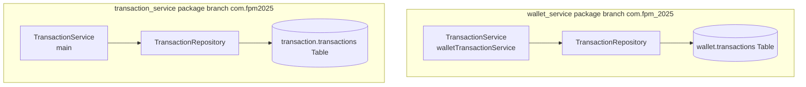

# 🔍 Đánh Giá Mức Độ Hoàn Thiện & Lỗ Hổng Kiến Trúc (FPM-2025)

Tài liệu này đánh giá chi tiết xem mã nguồn hiện tại trong `fpm-monolith` đã đáp ứng toàn bộ yêu cầu tính năng của dự án hay chưa, chỉ ra những gì đã làm được, những gì còn thiếu và các lỗ hổng/điểm dư thừa nghiêm trọng cần xử lý.

---

## 1. Đánh Giá Mức Độ Đáp Ứng Yêu Cầu (Feature Checklist)

Hệ thống đã triển khai đầy đủ khung nghiệp vụ (Business Flow) cốt lõi của FPM-2025 và sẵn sàng tương thích với App Android (Client) thông qua hệ thống REST API tương ứng:

| Nhóm Tính Năng | Yêu Cầu Dự Án | Trạng Thái Trong Monolith | Chi Tiết Đánh Giá |
|---|---|---|---|
| **User & Auth** | Đăng ký, đăng nhập JWT, Google OAuth2, Profile, Gia đình | 🟢 Hoàn thành | REST APIs đầy đủ. Tích hợp JWT Filter từ thư viện `fpm-security` dùng chung. |
| **Wallet** | Ví cá nhân/gia đình, share ví, phân quyền ví, tự động tạo ví mặc định | 🟢 Hoàn thành | Đầy đủ thực thể và phân quyền. Đã kết nối `UserCreatedListener` để tự động tạo ví "Tiền Mặt" khi đăng ký thành công qua in-memory Event. |
| **Transaction** | Ghi chép thu/chi, chuyển tiền, đính kèm hóa đơn | 🟢 Hoàn thành | APIs CRUD đầy đủ. Hỗ trợ upload và lưu trữ attachment metadata. |
| **Reporting** | Báo cáo tháng, biểu đồ xu hướng, cảnh báo ngân sách (Budget Alert) | 🟢 Hoàn thành | Cấu trúc DDD chuẩn. `TransactionEventConsumer` lắng nghe sự kiện in-memory để cập nhật báo cáo và xóa cache Redis. Xuất PDF/Excel hoạt động tốt. |
| **Push Notif** | Firebase push notification, lưu lịch sử thông báo | 🟢 Hoàn thành | FCM Firebase SDK được cấu hình qua `FirebaseConfig`. Tích hợp `NotificationListener` gửi real push tự động. |
| **OCR Scanner** | Upload hóa đơn, bóc tách thông tin tự động | 🟢 Hoàn thành | Tích hợp Tesseract thông qua `tess4j` OCR Engine, cấu hình sẵn tiếng Việt và tiếng Anh. |
| **AI Assistant** | Gợi ý danh mục, phát hiện chi tiêu bất thường, Chatbot tài chính | 🟢 Hoàn thành | Tích hợp trực tiếp Google Gemini 1.5 Flash API với cơ chế tự động fallback về Rule-based khi thiếu API Key. |

---

## 2. Các Lỗ Hổng & Điểm Dư Thừa Nghiêm Trọng (Critical Architecture Gaps)

Mặc dù hệ thống chạy được, việc gom 7 microservices cũ về một Monolith một cách máy móc (chỉ copy paste các package và sửa một số kết nối) đã để lại **những lỗi cấu hình cực kỳ nghiêm trọng và sự dư thừa dữ liệu nặng nề**:

### 🚨 Gap 1: Xung Đột Cấu Hình Bảo Mật (Conflicting Security Filter Chains) - **CỰC KỲ NGUY HIỂM**
Trong classpath hiện tại của `fpm-monolith` đang tồn tại **5 Bean `SecurityFilterChain` khác nhau** được khai báo thông qua chú thích `@Configuration` và `@EnableWebSecurity`:
1.  `com.fpm2025.monolith.config.MonolithSecurityConfig` (JWT Filter chặn và xác thực mọi request).
2.  `com.fpm_2025.wallet_service.config.SecurityConfig` (JWT Filter riêng của wallet-service).
3.  `com.fpm2025.user_auth_service.config.SecurityConfig` (Chứa `BCryptPasswordEncoder` và một filter chain **PERMIT ALL - cho phép mọi request đi qua**).
4.  `com.fpm2025.transaction_service.config.SecurityConfig` (JWT Filter riêng của transaction-service).
5.  `com.fpm_2025.reportingservice.config.SecurityConfig` (JWT Filter riêng của reporting-service).

#### Hậu quả:
Vì file `application.yml` cấu hình `spring.main.allow-bean-definition-overriding: true`, Spring Boot khi khởi chạy sẽ lấy một bean bất kỳ đè lên các bean còn lại.
*   **Kịch bản 1**: Nếu Bean từ `user_auth_service.config.SecurityConfig` (Permit All) thắng, **toàn bộ API bảo mật của hệ thống sẽ bị mở toang** (không cần JWT token vẫn truy cập và chỉnh sửa được ví/giao dịch của bất kỳ ai).
*   **Kịch bản 2**: Nếu một Bean bảo mật hẹp thắng, nó có thể chặn các URL công khai như `/api/v1/auth/login` hoặc `/swagger-ui/**`, khiến người dùng không thể đăng nhập.

> [!CAUTION]
> **Giải pháp khắc phục**: Phải xóa bỏ 4 cấu hình security cục bộ của các service con, chỉ giữ lại duy nhất một file cấu hình tập trung là `MonolithSecurityConfig.java` quản lý bảo mật cho toàn bộ Monolith.

---

### 🚨 Gap 2: Sự Tồn Tại Song Song Của Hai Hệ Thống Giao Dịch (Redundant Parallel Transactions)
Đây là tàn dư lớn nhất của việc gộp microservices. Hệ thống đang chạy song song **hai luồng ghi chép giao dịch hoàn toàn độc lập**:

#### Chi tiết sự dư thừa:
1.  **Hai bảng Database**: `wallet.transactions` (schema `wallet`) và `transaction.transactions` (schema `transaction`) cùng lưu trữ thông tin giao dịch.
2.  **Hai JPA Entities & Repositories**:
    *   `com.fpm_2025.wallet_service.entity.TransactionEntity` thao tác trên bảng `wallet.transactions`.
    *   `com.fpm2025.transaction_service.entity.TransactionEntity` thao tác trên bảng `transaction.transactions`.
3.  **Hai class Service trùng tên**:
    *   `com.fpm_2025.wallet_service.service.TransactionService` (được đặt tên bean là `"walletTransactionService"`).
    *   `com.fpm2025.transaction_service.service.TransactionService` (được tiêm trực tiếp vào `TransactionController` của transaction-service).

#### Hậu quả:
Dữ liệu giao dịch bị phân mảnh. Ví dụ: khi Client gọi API tạo giao dịch của transaction-service, thông tin giao dịch chỉ được lưu ở bảng `transaction.transactions`, trong khi bảng `wallet.transactions` hoàn toàn trống rỗng (hoặc ngược lại khi gọi API từ wallet-service). Điều này gây khó khăn cực lớn cho đối soát dữ liệu và báo cáo.

> [!IMPORTANT]
> **Giải pháp khắc phục**: Thống nhất luồng ghi chép giao dịch. Khuyến nghị loại bỏ bảng `wallet.transactions` và toàn bộ các class entity/repository/service liên quan của `wallet_service`, chuyển toàn bộ sang sử dụng hệ thống giao dịch của `transaction_service` làm chuẩn duy nhất.

---

### 🚨 Gap 3: Mã Rác & Tàn Dư Từ Cấu Hình Microservices (Dead Code Remnants)
Dù hệ thống đã giao tiếp in-memory rất tốt qua Spring Events và direct calls, trong mã nguồn vẫn còn sót lại rất nhiều "mã rác" từ thời Microservices:
*   Các class cấu hình và thư viện Client gRPC (`WalletGrpcClient`, `TransactionGrpcClient`) dù đã được sửa lại để gọi trực tiếp (Local Wrapper), việc đặt tên "gRPC" vẫn gây hiểu lầm lớn cho nhà phát triển mới.
*   Một số annotation `@KafkaListener` hoặc file cấu hình Kafka/RabbitMQ cũ chưa được dọn dẹp sạch sẽ, có thể gây lỗi nạp cấu hình khi khởi chạy ở các môi trường không cài đặt các Message Broker này.

---

## 3. Kế Hoạch Hành Động Khắc Phục (Action Plan)

Để hoàn thiện hệ thống Monolith đạt chuẩn sản xuất (Production-Ready), cần thực hiện 3 bước sau:

1.  **Dọn dẹp Bảo mật**:
    *   Xóa 4 file cấu hình `SecurityConfig.java` cục bộ trong `wallet_service`, `user_auth_service`, `transaction_service`, `reportingservice`.
    *   Hợp nhất toàn bộ quy tắc chặn/cho phép URL và cấu hình `BCryptPasswordEncoder` vào duy nhất `MonolithSecurityConfig.java`.
2.  **Hợp nhất Thực thể Giao dịch (Transaction Consolidation)**:
    *   Xóa bảng `wallet.transactions` trong schema SQL.
    *   Xóa bỏ entity, repository và service giao dịch trùng lặp bên phía `wallet_service`.
    *   Cập nhật `WalletService` để khi cần truy vấn lịch sử giao dịch thì tiêm và gọi trực tiếp `com.fpm2025.transaction_service.service.TransactionService`.
3.  **Chuẩn hóa Đặt tên & Refactor Mã rác**:
    *   Đổi tên `TransactionGrpcClient` và `WalletGrpcClient` trong `reportingservice` thành các tên mang tính in-memory như `TransactionLocalBridge` hay `WalletLocalBridge`.
    *   Loại bỏ hoàn toàn các file cấu hình liên quan đến Kafka, gRPC Server/Client thực sự nếu không còn dùng đến.

---
*Tài liệu phân tích và đánh giá lỗ hổng được thực hiện bởi Trợ lý AI (Antigravity).*
