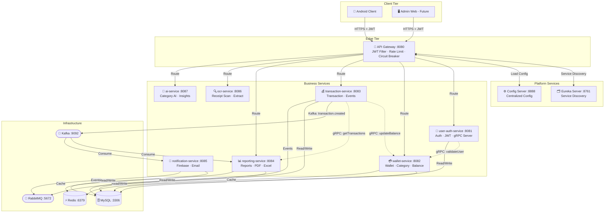
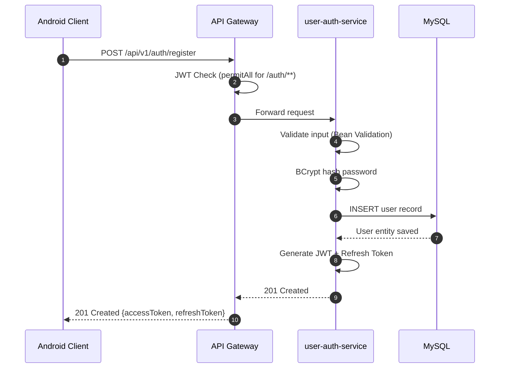
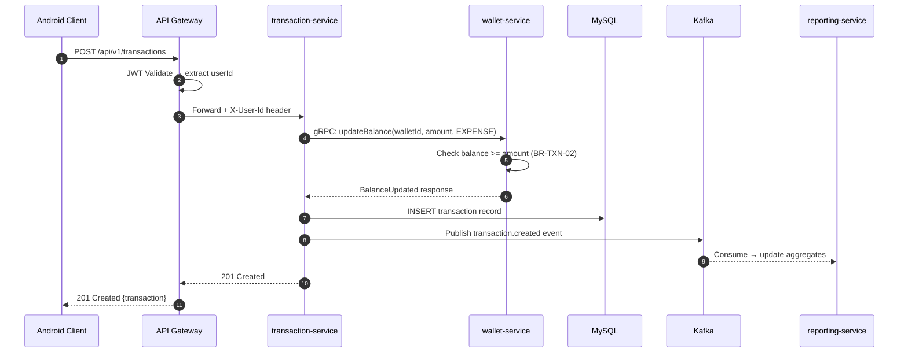

# 01 — FPM Project Overview

> **Document version:** 1.0  
> **Last updated:** 2026-05-15  
> **Maintainer:** Architecture Team  
> **Status:** 🟢 Active

---

## Table of Contents

1. [Business Objectives](#1-business-objectives)
2. [System Architecture Overview](#2-system-architecture-overview)
3. [Technology Stack](#3-technology-stack)
4. [Service Inventory](#4-service-inventory)
5. [Infrastructure Components](#5-infrastructure-components)
6. [High-Level Architecture Diagram](#6-high-level-architecture-diagram)
7. [Repository Structure](#7-repository-structure)
8. [Key Design Decisions](#8-key-design-decisions)

---

## 1. Business Objectives

**FPM** (Financial Portfolio Manager) là một ứng dụng **quản lý tài chính cá nhân** nhắm đến người dùng cá nhân muốn theo dõi, phân tích và tối ưu hóa tài chính của mình theo thời gian thực.

### 1.1 Core Problem Statement

> *"Người dùng không có một nơi duy nhất, thông minh và bảo mật để quản lý toàn bộ tài chính cá nhân — từ nhiều ví, giao dịch hàng ngày, phân tích chi tiêu theo danh mục, đến cảnh báo ngân sách và báo cáo xuất file."*

### 1.2 Business Domains

| # | Domain | Mô tả |
|---|--------|--------|
| 1 | **Identity & Access** | Đăng ký, đăng nhập, OAuth2 Google, quản lý session JWT |
| 2 | **Wallet Management** | Tạo/quản lý nhiều ví (tiền mặt, thẻ, ngân hàng) |
| 3 | **Transaction Management** | CRUD giao dịch, tự động điều chỉnh số dư, lịch sử |
| 4 | **Category & Budget** | Phân loại chi tiêu, đặt ngân sách, cảnh báo vượt ngưỡng |
| 5 | **Reporting & Analytics** | Báo cáo tháng, biểu đồ Income/Expense, export PDF/Excel/CSV |
| 6 | **Notification** | Thông báo push Firebase, cảnh báo ngân sách, tóm tắt giao dịch |
| 7 | **OCR & AI** | Quét hóa đơn bằng OCR, gợi ý danh mục bằng AI |

### 1.3 Target Users

- **Primary**: Cá nhân muốn quản lý tài chính cá nhân trên mobile
- **Future**: Admin dashboard cho quản trị hệ thống

### 1.4 Business Rules Summary

| Code | Rule |
|------|------|
| `BR-AUTH-01` | Email phải unique; password BCrypt-hashed |
| `BR-AUTH-05` | JWT hết hạn → bắt buộc dùng refresh token |
| `BR-AUTH-06` | Logout → token blacklist vào Redis |
| `BR-WALLET-04` | Xóa wallet → soft delete |
| `BR-WALLET-05` | Wallet inactive không được tạo transaction mới |
| `BR-TXN-02` | Expense: kiểm tra `balance >= amount` |
| `BR-TXN-07` | Transaction phải publish event `transaction_created` |
| `BR-REPORT-03` | Cache report 5 phút trong Redis |
| `BR-SEC-01` | Mọi request phải đi qua API Gateway |
| `BR-SEC-03` | Rate limit login: 5 attempts / 5 phút / IP |

---

## 2. System Architecture Overview

### 2.1 Architecture Pattern

FPM sử dụng **Cloud-Native Microservices Architecture** với các pattern nổi bật:

| Pattern | Triển khai |
|---------|------------|
| **Service Registry** | Spring Cloud Netflix Eureka |
| **API Gateway** | Spring Cloud Gateway (reactive WebFlux) |
| **Centralized Config** | Spring Cloud Config Server (native profile) |
| **Event-Driven** | Apache Kafka + RabbitMQ (dual broker) |
| **Synchronous RPC** | gRPC (Spring gRPC 0.10.0) |
| **Circuit Breaker** | Resilience4j |
| **Distributed Cache** | Redis 7 |
| **Domain-Driven Design** | Reporting service áp dụng DDD Bounded Context |
| **CQRS (lite)** | Reporting service tách read/write |

### 2.2 Communication Patterns

```
Client → API Gateway (REST/HTTP)
                │
    ┌──────────┼──────────────┐
    │           │             │
REST/HTTP   gRPC (sync)   Kafka/RabbitMQ (async)
    │           │             │
Service     Service       Service
```

**Synchronous (Real-time):**
- REST API: Client → Gateway → Services
- gRPC: Wallet ↔ User-Auth, Transaction → Wallet

**Asynchronous (Event-Driven):**
- Kafka: Transaction events → Reporting Service
- RabbitMQ: Domain events (wallet.created, etc.)

### 2.3 Security Architecture

```
Client
  │
  ▼
[API Gateway] ─── JWT Validation (JwtAuthenticationFilter)
  │                    └── Spring Security WebFlux
  ▼
[Microservices] ─── JWT Re-validation (fpm-security lib)
  │                      └── Extract userId from token
  ▼
[Data Layer] ─── Row-level ownership check (userId)
```

---

## 3. Technology Stack

### 3.1 Core Framework

| Layer | Technology | Version |
|-------|------------|---------|
| Language | Java | **21** (LTS) |
| Framework | Spring Boot | **3.5.5** |
| Build | Maven | 3.9+ |
| Cloud | Spring Cloud | **2025.0.0** |

### 3.2 Communication

| Protocol | Library | Usage |
|----------|---------|-------|
| REST | Spring MVC / WebFlux | Client API, Gateway |
| gRPC | Spring gRPC | **0.10.0** – Inter-service sync |
| Protobuf | Protocol Buffers | **4.30.2** – gRPC schema |

### 3.3 Messaging & Streaming

| Component | Technology | Version |
|-----------|------------|---------|
| Event Streaming | Apache Kafka | Confluent **7.5.0** |
| Message Broker | RabbitMQ | **3.12-management** |
| Broker Coordination | Zookeeper | Confluent 7.5.0 |

### 3.4 Data & Storage

| Component | Technology | Version |
|-----------|------------|---------|
| Relational DB | MySQL | **8.0** |
| Cache / Session | Redis | **7-alpine** |
| ORM | Spring Data JPA + Hibernate | Spring Boot BOM |
| Migration | Flyway | BOM version |

### 3.5 Security

| Component | Technology |
|-----------|------------|
| Authentication | JWT (JJWT **0.12.5**) |
| Password Encoding | BCrypt |
| OAuth2 | Google OAuth2 |
| API Security | Spring Security (Servlet + Reactive) |
| Rate Limiting | Resilience4j |

### 3.6 Infrastructure & DevOps

| Component | Technology |
|-----------|------------|
| Containerization | Docker |
| Orchestration (local) | Docker Compose |
| Service Registry | Spring Cloud Netflix Eureka |
| Config Server | Spring Cloud Config (native) |
| API Documentation | Springdoc OpenAPI (Swagger UI) |
| Monitoring | Spring Actuator + Micrometer |
| Metrics | Prometheus |
| Mobile Client | Android (Kotlin) |
| Push Notification | Firebase FCM |

### 3.7 Shared Libraries (`fpm-libs`)

| Library | Responsibility |
|---------|---------------|
| `fpm-bom` | Bill of Materials – version centralization |
| `fpm-core` | BaseResponse, Mapper, Exception handling, JWT, Redis config |
| `fpm-domain` | Shared domain enums, constants, DTOs, events |
| `fpm-common` | Common utilities (DateUtil, ValidationUtil, PageUtil) |
| `fpm-grpc` | gRPC interceptors, client config, auto-generated stubs |
| `fpm-proto` | `.proto` definitions cho tất cả services |
| `fpm-messaging` | DomainEvent, EventPublisher, RabbitMQ config |
| `fpm-security` | JWT filter, Spring Security config có thể tái sử dụng |
| `fpm-testing` | Testcontainers base, TestDataFactory, custom assertions |

---

## 4. Service Inventory

| Service | Container | Port | DB | Description |
|---------|-----------|------|-----|-------------|
| `api-gateway` | `fpm-api-gateway` | **8080→8089** | — | Entry point duy nhất cho mọi client request |
| `eureka-server` | `fpm-eureka-server` | **8761** | — | Service registry và discovery |
| `config-server` | `fpm-config-server` | **8888** | — | Centralized config management |
| `user-auth-service` | `fpm-user-auth-service` | **8081** | `user_auth_db` | Auth, JWT, user profile, gRPC server |
| `wallet-service` | `fpm-wallet-service` | **8082** | `wallet_db` | Wallet CRUD, balance management, categories |
| `transaction-service` | `fpm-transaction-service` | **8083** / gRPC **9093** | `transaction_db` | Transaction CRUD, event publishing |
| `reporting-service` | `fpm-reporting-service` | **8084** | `reporting_db` | Aggregated reports, export PDF/Excel/CSV |
| `notification-service` | `fpm-notification-service` | **8085** | `notification_db` | Firebase push, email notification |
| `ocr-service` | `fpm-ocr-service` | **8086** | — | Scan receipts, extract transaction data |
| `ai-service` | `fpm-ai-service` | **8087** | — | Category suggestion, financial insights |

---

## 5. Infrastructure Components

| Component | Container | Port(s) | Purpose |
|-----------|-----------|---------|---------|
| MySQL 8 | `fpm-mysql` | **3306** | Primary relational database |
| Redis 7 | `fpm-redis` | **6379** | Cache, token blacklist, rate limit |
| Kafka | `fpm-kafka` | **9092** (internal) / **29092** (host) | Event streaming |
| Zookeeper | `fpm-zookeeper` | 2181 | Kafka coordinator |
| RabbitMQ | `fpm-rabbitmq` | **5672** (AMQP) / **15672** (UI) | Domain event messaging |

---

## 6. High-Level Architecture Diagram

### 6.1 System Context Diagram



### 6.2 Request Flow: Register New User



### 6.3 Request Flow: Create Transaction



---

## 7. Repository Structure

```
FPM_Project/
├── Backend/                    # Microservices parent module
│   ├── pom.xml                 # Parent POM (fpm-backend-parent)
│   ├── docker-compose.yml      # Full stack orchestration
│   ├── api-gateway/            # Spring Cloud Gateway
│   ├── eureka-server/          # Netflix Eureka
│   ├── user-auth-service/      # Identity & Access
│   ├── wallet-service/         # Wallet Management
│   ├── transaction-service/    # Transaction Management
│   ├── reporting_service/      # Reporting & Analytics (note: underscore)
│   ├── notification-service/   # Push Notifications
│   ├── ocr-service/            # OCR Receipt Scanning
│   └── ai-service/             # AI Category Suggestions
│
├── config/                     # Spring Cloud Config Server
│   └── src/main/resources/
│       └── config/
│           ├── yml_service/    # Per-service YAML configs
│           └── application.yml # Global config
│
├── libs/
│   └── fpm-libs/               # Shared internal libraries
│       ├── fpm-bom/
│       ├── fpm-common/
│       ├── fpm-core/
│       ├── fpm-domain/
│       ├── fpm-grpc/
│       ├── fpm-messaging/
│       ├── fpm-proto/
│       ├── fpm-security/
│       └── fpm-testing/
│
├── fpm_client/                 # Android client application
│
├── sql/
│   └── init-databases.sql      # DB initialization script
│
└── docs/
    ├── 01_PROJECT_OVERVIEW.md  ← You are here
    ├── 02_ARCHITECTURE_PART1.md
    └── 02_ARCHITECTURE_PART2.md
```

> **⚠️ Naming Discrepancy:** Reporting service sử dụng `reporting_service` (dấu gạch dưới) làm tên thư mục, nhưng artifact ID là `reporting-service` (dấu gạch ngang). Cần chú ý khi build và deploy.

---

## 8. Key Design Decisions

### 8.1 Dual Message Broker Strategy

| Broker | Use Case | Rationale |
|--------|----------|-----------|
| **Kafka** | Transaction events → Reporting | High-throughput streaming, replay, long retention |
| **RabbitMQ** | Domain events (wallet.created, etc.) | Flexible routing (Exchange/Queue), low latency |

### 8.2 gRPC for Internal Sync Communication

- **Type-safe**: Proto contracts enforce API contract
- **Efficient**: Protobuf binary (~5x nhỏ hơn JSON)
- **Streaming**: Sẵn sàng cho server/client streaming

### 8.3 Centralized Configuration Management

Spring Cloud Config Server với `native` profile đọc YAML từ filesystem mount, cho phép:
- Config thay đổi không cần rebuild image
- Dễ dàng override bằng environment variable trong Docker

### 8.4 Shared Library Strategy (`fpm-libs`)

- **Consistency**: Standard response format, error codes trên tất cả services
- **Security**: JWT validation tập trung ở một nơi
- **Velocity**: Onboarding service mới nhanh hơn đáng kể

### 8.5 Java 21 + Spring Boot 3.5

- **Virtual Threads** (Project Loom): Sẵn sàng cho throughput cao
- **Spring Security 6**: Lambda DSL, hiện đại hơn
- **Spring Boot Actuator + Micrometer**: Native Prometheus metrics

---

> 📌 **Tiếp theo:** Xem `02_ARCHITECTURE_PART1.md` để hiểu chi tiết về DDD, API Gateway, và Authentication flow.
