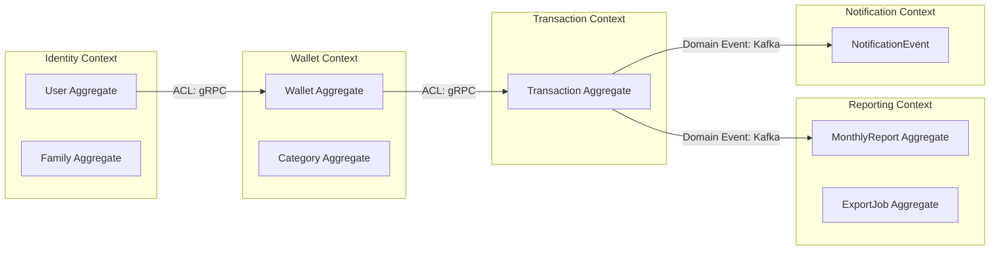
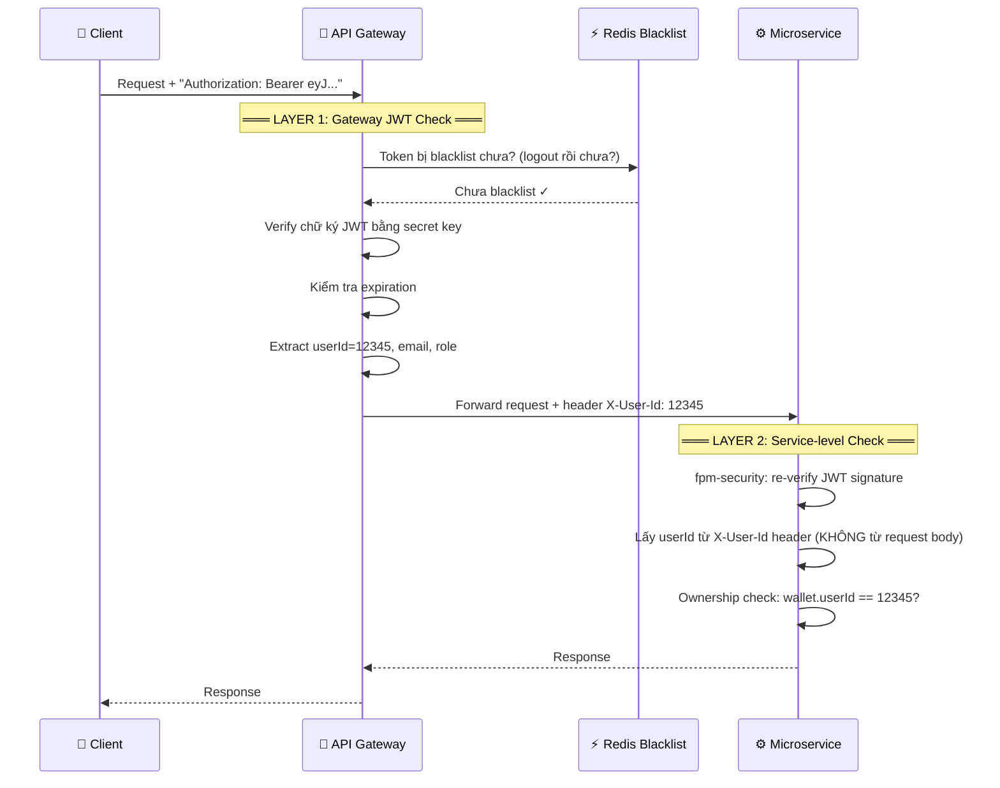
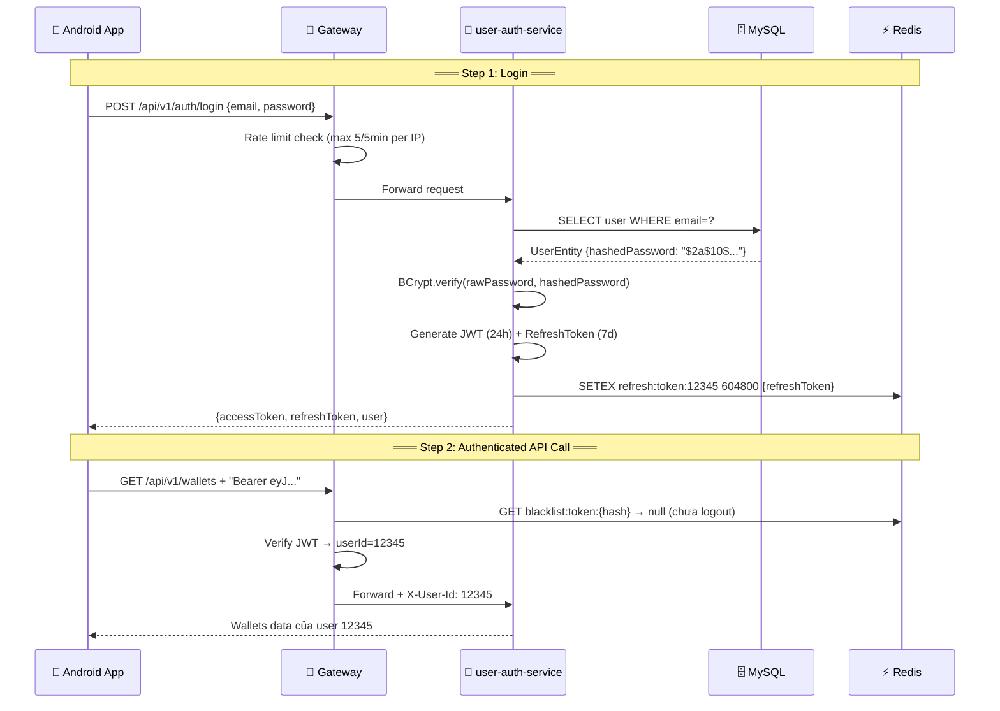

# 02 — Architecture Deep Dive (Part 1: Edge & Domain Layer)

> **Document version:** 2.0 — Enhanced with technical term definitions  
> **Last updated:** 2026-05-15

---

## 📖 How to Read This Document

Throughout this document, technical terms are explained inline using this format:

> 💡 **Term Definition** — Plain-language explanation of what the term means and why it's used here.

---

## Table of Contents

1. [Domain-Driven Design & Bounded Contexts](#1-domain-driven-design--bounded-contexts)
2. [API Gateway — Edge Layer](#2-api-gateway--edge-layer)
3. [Authentication & Authorization Flow](#3-authentication--authorization-flow)

---

## 1. Domain-Driven Design & Bounded Contexts

### What is Domain-Driven Design (DDD)?

> 💡 **DDD (Domain-Driven Design)** — Một phương pháp thiết kế phần mềm trong đó cấu trúc code phản ánh chính xác nghiệp vụ thực tế. Thay vì thiết kế theo layer kỹ thuật (controller → service → repository), DDD tổ chức code theo "domains" (lĩnh vực nghiệp vụ) như: Wallet, Transaction, Reporting...

FPM áp dụng DDD ở mức **Strategic Design** — tức là chia hệ thống thành các vùng nghiệp vụ độc lập.

---

### 1.1 Bounded Contexts — Ranh giới nghiệp vụ

> 💡 **Bounded Context** — Một "vùng biên" rõ ràng trong đó một khái niệm nghiệp vụ có định nghĩa nhất quán. Ví dụ: "Wallet" trong `wallet-service` có nghĩa cụ thể (số dư, loại ví), nhưng trong `reporting-service`, Wallet chỉ là một ID tham chiếu — không cần biết chi tiết nội bộ.
>
> **Tại sao cần Bounded Context?** Ngăn chặn "Big Ball of Mud" — khi tất cả services dùng chung model và thay đổi ở một nơi phá vỡ toàn bộ hệ thống.

FPM có **7 Bounded Contexts**, mỗi context = 1 microservice:

| Bounded Context | Service | Trách nhiệm chính | Các Aggregate (đối tượng nghiệp vụ chính) |
|-----------------|---------|-------------------|-------------------------------------------|
| **Identity** | `user-auth-service` | Quản lý người dùng, xác thực | `User`, `Family`, `Token` |
| **Wallet** | `wallet-service` | Quản lý ví, danh mục, ngân sách | `Wallet`, `Category`, `Budget` |
| **Transaction** | `transaction-service` | Ghi nhận giao dịch, điều chỉnh số dư | `Transaction` |
| **Reporting** | `reporting-service` | Tổng hợp báo cáo, xuất file | `MonthlyReport`, `ExportJob` |
| **Notification** | `notification-service` | Gửi thông báo push, email | `NotificationEvent` |
| **OCR** | `ocr-service` | Quét hóa đơn, trích xuất dữ liệu | `OcrResult`, `ParsedReceipt` |
| **AI** | `ai-service` | Gợi ý danh mục, phân tích tài chính | `CategorySuggestion` |



---

### 1.2 Anti-Corruption Layer (ACL)

> 💡 **Anti-Corruption Layer (ACL)** — Một lớp "phiên dịch" nằm giữa 2 service. Khi service A cần dữ liệu từ service B, ACL sẽ chuyển đổi (map/translate) model của B sang model nội bộ của A — tránh việc B "xâm nhập" vào domain của A.
>
> **Ví dụ thực tế:** `transaction-service` gọi gRPC lấy ví từ `wallet-service`. Response trả về kiểu `WalletResponse` (proto). ACL trong transaction-service chuyển nó thành `WalletSnapshot` (internal DTO) — nếu wallet-service đổi proto, chỉ cần sửa ACL, không sửa business logic.

| Caller Service | Provider | Cơ chế | Bước ACL |
|----------------|----------|--------|----------|
| `wallet-service` | `user-auth-service` | gRPC | `UserResponse` (proto) → `UserInfo` (internal DTO) |
| `transaction-service` | `wallet-service` | gRPC | `WalletResponse` (proto) → `WalletSnapshot` |
| `reporting-service` | `transaction-service` | Kafka event | `TransactionCreatedEvent` → `ReportEntry` |

---

### 1.3 Shared Kernel — Shared Domain Library

> 💡 **Shared Kernel** — Phần nhỏ của domain model được chia sẻ giữa các Bounded Contexts, được cả hai bên đồng ý sử dụng. Trong FPM, đây là thư viện `fpm-domain` chứa các enum và constant dùng chung — nhưng KHÔNG chứa business logic.

```
fpm-domain/
├── enums/
│   ├── CategoryType    → INCOME hoặc EXPENSE (dùng ở transaction + wallet + reporting)
│   ├── WalletType      → CASH, CARD, BANK
│   └── CurrencyCode    → VND, USD, ...
├── constants/
│   ├── DomainConstants.Wallet  → MIN_BALANCE = 0, MAX_BALANCE = 1_000_000_000
│   ├── DomainConstants.Cache   → TTL (time-to-live) cho các loại cache
│   └── DomainConstants.Event   → Tên các Kafka topics
└── event/
    └── DomainEvent (abstract class — base cho tất cả events)
```

---

## 2. API Gateway — Edge Layer

### What is an API Gateway?

> 💡 **API Gateway** — "Cửa ngõ duy nhất" của toàn bộ hệ thống. Thay vì client (Android app) gọi thẳng từng service, client chỉ nói chuyện với Gateway. Gateway chịu trách nhiệm: xác thực JWT, phân phối request đến đúng service, giới hạn tốc độ, và xử lý khi service bị lỗi.
>
> **FPM dùng:** Spring Cloud Gateway — chạy trên **Reactive WebFlux** (non-blocking I/O, xử lý hàng nghìn request đồng thời mà không cần nhiều thread).

> 💡 **Reactive WebFlux (Non-blocking I/O)** — Mô hình lập trình không chặn thread. Thay vì mỗi request chiếm 1 thread (servlet model), WebFlux xử lý bất đồng bộ — 1 thread có thể phục vụ nhiều request. Điều này giúp Gateway không bị nghẽn khi downstream service phản hồi chậm.

```
Incoming Request
       │
       ▼
┌────────────────────────────────────────┐
│          Spring Cloud Gateway          │
│                                        │
│  Bước 1: Route Matching               │
│    → Xem path nào khớp route nào      │
│                                        │
│  Bước 2: JwtAuthenticationFilter      │
│    → Kiểm tra JWT có hợp lệ không     │
│                                        │
│  Bước 3: RedisRateLimiter             │
│    → Đếm số request của user/IP       │
│                                        │
│  Bước 4: CircuitBreaker               │
│    → Nếu service downstream bị lỗi   │
│      → redirect về /fallback          │
│                                        │
│  Bước 5: Load Balancer (lb://)        │
│    → Chọn instance service nào        │
│      từ Eureka registry               │
└────────────────────────────────────────┘
       │
       ▼
  Downstream Service
```

---

### 2.1 Route Table — Bảng định tuyến

> 💡 **Route** — Một quy tắc ánh xạ: "Nếu request có path `/api/v1/wallets/**` thì chuyển đến `wallet-service`". Gateway so khớp từng route theo thứ tự từ trên xuống dưới.

| Route ID | Path | Service đích | Rate Limit đặc biệt | Cần xác thực? |
|----------|------|-------------|---------------------|---------------|
| `user-auth-login` | `POST /api/v1/auth/login` | `user-auth-service` | **Nghiêm ngặt**: 1 req/s, tối đa 5 burst | ❌ Không |
| `user-auth-register` | `POST /api/v1/auth/register` | `user-auth-service` | Nghiêm ngặt (như login) | ❌ Không |
| `user-auth-service` | `/api/v1/auth/**`, `/api/v1/users/**`, `/api/v1/families/**` | `user-auth-service` | Chuẩn | ✅ Có |
| `wallet-service` | `/api/v1/wallets/**`, `/api/v1/categories/**` | `wallet-service` | Chuẩn | ✅ Có |
| `transaction-service` | `/api/v1/transactions/**` | `transaction-service` | Chuẩn | ✅ Có |
| `reporting-service` | `/api/v1/reports/**`, `/api/v1/dashboard/**`, `/api/v1/budgets/**` | `reporting-service` | Chuẩn | ✅ Có |
| `notification-service` | `/api/v1/notifications/**` | `notification-service` | Chuẩn | ✅ Có |
| `ocr-service` | `/api/v1/ocr/**` | `ocr-service` | Chuẩn | ✅ Có |
| `ai-service` | `/api/v1/ai/**` | `ai-service` | Chuẩn | ✅ Có |

> 💡 **`lb://user-auth-service`** — Tiền tố `lb://` nghĩa là "Load Balanced". Gateway hỏi Eureka: "Danh sách instances của `user-auth-service` là gì?" rồi chọn ngẫu nhiên hoặc round-robin. Nếu có 2 instances đang chạy, traffic được phân chia đều.

**Rate Limit chuẩn:** 100 req/giây, burst tối đa 120 — theo dõi theo `X-User-Id` header (nếu không có thì theo IP).

---

### 2.2 Circuit Breaker — Cầu dao ngắt mạch

> 💡 **Circuit Breaker** — Tương tự cầu dao điện trong nhà. Khi service bị lỗi liên tục, Circuit Breaker "mở" (OPEN) — dừng gọi service đó ngay lập tức, tránh cascade failure (lỗi lan rộng). Sau một thời gian, tự thử lại (HALF-OPEN). Nếu OK thì "đóng" lại (CLOSED — hoạt động bình thường).
>
> **Tại sao cần?** Nếu `transaction-service` bị chết và Gateway vẫn tiếp tục gọi → mỗi request bị timeout 10 giây → client bị treo → hệ thống collateral damage. Circuit Breaker ngăn điều này.

**Cấu hình thực tế** (từ `RouteConfig.java`):

```java
CircuitBreakerConfig.custom()
    .slidingWindowSize(10)           // Xét 10 request gần nhất
    .minimumNumberOfCalls(5)         // Phải có ít nhất 5 calls mới đánh giá
    .failureRateThreshold(50)        // Nếu >= 50% thất bại → OPEN
    .waitDurationInOpenState(30s)    // Chờ 30 giây rồi thử HALF-OPEN
    .permittedNumberOfCallsInHalfOpenState(3) // Thử 3 request khi HALF-OPEN
    .timeoutDuration(10s)            // Mỗi request chờ tối đa 10 giây
```

```
CLOSED ──(>=50% fail)──► OPEN ──(wait 30s)──► HALF-OPEN
  ▲                                                │
  └─────────(3 calls OK)──────────────────────────┘
                              └──(1 call fail)──► OPEN
```

| State | Nghĩa | Hành động |
|-------|-------|-----------|
| **CLOSED** | Bình thường | Mọi request được chuyển tới service |
| **OPEN** | Service bị lỗi | Reject ngay, trả về `/fallback` response |
| **HALF-OPEN** | Đang thử phục hồi | Cho 3 request test qua, theo dõi kết quả |

---

### 2.3 Rate Limiting — Giới hạn tốc độ

> 💡 **Rate Limiting** — Giới hạn số lượng request trong một khoảng thời gian. Mục đích: ngăn brute-force attack, bảo vệ server khỏi bị quá tải.
>
> 💡 **Token Bucket Algorithm** — Hãy tưởng tượng một cái xô chứa "token". Mỗi giây xô được đổ thêm `replenishRate` tokens. Mỗi request tiêu thụ 1 token. Nếu xô rỗng → request bị từ chối với HTTP 429.
>
> `replenishRate=1, burstCapacity=5`: Đổ 1 token/giây, xô chứa tối đa 5 tokens → có thể gửi 5 request liên tiếp ngay lập tức (burst), sau đó chỉ 1 req/giây.

**FPM có 2 mức Rate Limit:**

```
Login/Register (Strict)          Các API khác (Standard)
replenishRate = 1               replenishRate = 100
burstCapacity = 5               burstCapacity = 120
→ Phòng brute-force password    → Cho phép usage bình thường
```

**Thêm tại Service level** (Resilience4j trong `user-auth-service`):
```yaml
resilience4j.ratelimiter:
  instances:
    login:
      limitForPeriod: 5        # Tối đa 5 lần
      limitRefreshPeriod: 5m   # Trong mỗi 5 phút (Business Rule BR-SEC-03)
```

---

## 3. Authentication & Authorization Flow

### Định nghĩa cơ bản

> 💡 **Authentication (Xác thực)** — Trả lời câu hỏi: "Bạn là ai?" → Kiểm tra email/password, cấp JWT.
>
> 💡 **Authorization (Phân quyền)** — Trả lời câu hỏi: "Bạn có được làm điều này không?" → Kiểm tra JWT để xem user có quyền truy cập resource đó không.
>
> 💡 **JWT (JSON Web Token)** — Một chuỗi token gồm 3 phần được mã hóa bằng Base64, ngăn cách bởi dấu `.`. Phần Payload chứa thông tin user. Phần Signature được ký bằng secret key để đảm bảo không bị giả mạo. Server không cần lưu session — chỉ cần verify chữ ký là xác nhận được token hợp lệ.

---

### 3.1 Cấu trúc JWT trong FPM

```
eyJhbGciOiJIUzI1NiJ9   .   eyJ1c2VySWQiOjEyMzQ1...   .   SflKxwRJSMeKKF2QT...
      │                              │                               │
   Header                        Payload                        Signature
 (algorithm: HS256)         (decoded content):              (HMAC SHA-256 of
                             {                               Header + Payload
                               "userId": 12345,             using secret key)
                               "email": "u@mail.com",
                               "role": "USER",
                               "iat": 1715000000,    ← issued at (thời điểm tạo)
                               "exp": 1715086400     ← expiration (hết hạn sau 24h)
                             }
```

> 💡 **HS256 (HMAC SHA-256)** — Thuật toán ký JWT dùng **một secret key duy nhất** cho cả việc ký và verify. Đơn giản nhưng cần bảo mật secret cẩn thận. Alternative là RS256 (dùng private/public key pair).

**Token lifecycle:**
- **Access Token**: Hết hạn sau **24 giờ**
- **Refresh Token**: Hết hạn sau **7 ngày**, lưu trong Redis
- **Blacklist**: Logout → token lưu vào Redis với TTL = thời gian còn lại, key: `blacklist:token:{hash}`

---

### 3.2 Dual-Layer Validation — Xác thực 2 lớp

> 💡 **Dual-Layer Validation** — FPM validate JWT ở cả 2 nơi: tại Gateway (Layer 1) và tại từng Service (Layer 2). Đây là **Defense in Depth** (bảo mật theo chiều sâu) — nếu một lớp bị bypass, lớp kia vẫn chặn.



> ⚠️ **Mass Assignment Attack** — Nếu client gửi `{"userId": 999, "walletId": 5}` và service dùng `userId` từ body → attacker có thể đọc/sửa dữ liệu của user khác. FPM luôn lấy `userId` từ JWT header đã được Gateway inject (BR-AUTH-07).

---

### 3.3 Public Endpoints — Không cần JWT

| Path | Lý do public |
|------|-------------|
| `/api/v1/auth/login` | Cần gọi trước khi có token |
| `/api/v1/auth/register` | Người dùng mới chưa có token |
| `/actuator/**` | Health check cho Docker/Load balancer |
| `/swagger-ui/**`, `/v3/api-docs/**` | API documentation (dev only) |
| `/fallback` | Circuit breaker redirect nội bộ |

---

### 3.4 Complete Auth Flow: Login → API Call



> 💡 **BCrypt** — Thuật toán hash password một chiều với "salt" (chuỗi ngẫu nhiên). Không thể reverse để lấy lại password gốc. `"$2a$10$..."` — `10` là "cost factor" (số vòng hash = 2^10 = 1024 iterations), càng cao càng chậm → khó brute-force.

---

> 📌 **Tiếp theo:** Xem `02_ARCHITECTURE_PART2.md` để hiểu gRPC, Kafka/RabbitMQ, Service Discovery, và kiến trúc dữ liệu.
