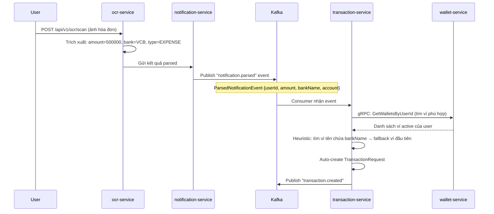
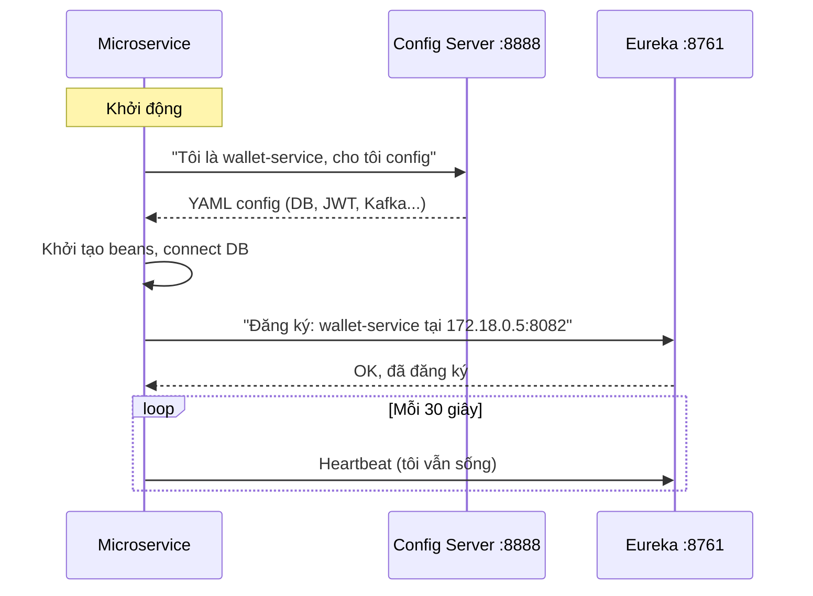

# 02 — Architecture Deep Dive (Part 2: Communication & Data)

> **Document version:** 2.0 — Enhanced with technical term definitions  
> **Last updated:** 2026-05-15  
> **Prerequisite:** Đọc `02_ARCHITECTURE_PART1.md` trước

---

## Table of Contents

4. [Synchronous Communication — gRPC](#4-synchronous-communication--grpc)
5. [Asynchronous Communication — Kafka & RabbitMQ](#5-asynchronous-communication--kafka--rabbitmq)
6. [Service Discovery & Config Management](#6-service-discovery--config-management)
7. [Data Architecture](#7-data-architecture)
8. [Resilience Patterns](#8-resilience-patterns)
9. [Architecture Gap Analysis](#9-architecture-gap-analysis)

---

## 4. Synchronous Communication — gRPC

### Định nghĩa gRPC

> 💡 **gRPC (Google Remote Procedure Call)** — Framework giao tiếp giữa các service, cho phép service A gọi một function của service B như thể gọi function cục bộ, nhưng thực tế qua mạng. So với REST API (gửi JSON qua HTTP/1.1), gRPC dùng **Protobuf** (binary) qua **HTTP/2** → nhanh hơn ~5-7x, payload nhỏ hơn ~3-5x.

> 💡 **Protobuf (Protocol Buffers)** — Format serialize dữ liệu của Google. Thay vì JSON text (`{"userId": 12345}`), Protobuf encode thành binary bytes nhỏ gọn hơn. Phải định nghĩa schema trước trong file `.proto`, từ đó auto-generate code Java.

> 💡 **HTTP/2** — Phiên bản HTTP cải tiến: hỗ trợ multiplexing (nhiều request trên 1 connection), header compression, binary protocol. gRPC bắt buộc dùng HTTP/2.

**So sánh REST vs gRPC trong FPM:**

| Tiêu chí | REST (Client ↔ Gateway) | gRPC (Service ↔ Service) |
|----------|------------------------|--------------------------|
| Format | JSON (text) | Protobuf (binary) |
| Protocol | HTTP/1.1 | HTTP/2 |
| Schema | Optional (Swagger) | Bắt buộc (`.proto` file) |
| Code gen | Không | Tự động từ proto |
| Tốc độ | Chuẩn | ~5-7x nhanh hơn |
| Dùng khi | Public API | Internal service calls |

---

### 4.1 Proto Contract Catalog — 6 file định nghĩa API

> 💡 **Proto Contract** — File `.proto` là "hợp đồng" giữa 2 service: định nghĩa rõ function nào có, input/output là gì. Nếu 1 bên thay đổi proto mà không báo bên kia → compile error ngay khi build.

**6 proto files** trong `fpm-libs/fpm-proto/src/main/protocol/`:

| File | Defines Service | Nơi implement (Server) | Ai gọi (Client) |
|------|----------------|------------------------|-----------------|
| `user.proto` | `UserGrpcService` | `user-auth-service` :9090 | Gateway, wallet, reporting |
| `wallet.proto` | `WalletGrpcService` | `wallet-service` | transaction, notification |
| `transaction.proto` | `TransactionGrpcService` | `transaction-service` :9093 | reporting |
| `category.proto` | `CategoryGrpcService` | `wallet-service` | transaction |
| `sharing.proto` | `SharingGrpcService` | `user-auth-service` | reporting |
| `common.proto` | Shared messages | *(không có server)* | Tất cả services |

> 💡 **`common.proto`** — Chứa các message dùng chung như `Money` (amount + currency), `PageResponse` (pagination info), `UserIdRequest`. Tránh duplicate định nghĩa giữa các proto file.

---

### 4.2 UserGrpcService — API xác thực & lấy thông tin user

```protobuf
// user.proto
service UserGrpcService {
  rpc ValidateToken(TokenRequest)         returns (TokenValidationResponse);
  // → Gateway gọi trên MỌI authenticated request
  // → Verify JWT signature + check user còn tồn tại trong DB

  rpc GetUserById(UserIdRequest)          returns (UserResponse);
  // → wallet-service gọi khi tạo ví mới (cần verify user tồn tại)

  rpc GetUsersByIds(UserIdsRequest)       returns (UsersResponse);
  // → reporting-service gọi để lấy thông tin nhiều user cho family report

  rpc GetFamilyMembers(FamilyIdRequest)   returns (FamilyMembersResponse);
  // → reporting-service gọi để lấy danh sách thành viên gia đình

  rpc CheckUserExists(UserIdRequest)      returns (UserExistsResponse);
  // → Quick existence check, không trả về full user data
}
```

**`ValidateToken` flow thực tế** (code từ `UserGrpcServiceImpl.java`):
```
1. Nhận token string
2. token null/blank → return {valid: false}
3. jwtTokenProvider.validateToken(token) → check signature + expiry
4. extractUserId(token), extractEmail(token)
5. userRepository.existsByEmail(email) → check user chưa bị xóa
6. return {valid: true, userId, email}
```

---

### 4.3 WalletGrpcService — API quản lý số dư

```protobuf
// wallet.proto
service WalletGrpcService {
  rpc UpdateBalance(UpdateBalanceRequest)         returns (WalletResponse);
  // operation: "ADD" (income), "SUBTRACT" (expense), "SET"
  // → transaction-service gọi sau khi tạo transaction

  rpc CheckSufficientBalance(BalanceCheckRequest) returns (BalanceCheckResponse);
  // → Kiểm tra balance >= amount TRƯỚC khi tạo expense transaction (BR-TXN-02)
  // → Nếu false → transaction-service reject ngay, không tạo record

  rpc ValidateWalletAccess(WalletAccessRequest)   returns (WalletAccessResponse);
  // → Kiểm tra user có quyền với wallet này không
  // → permission_level: "OWNER" | "WRITE" | "READ"

  rpc GetWalletsByUserId(UserWalletsRequest)       returns (WalletsResponse);
  // → transaction-service gọi để tìm wallet phù hợp khi auto-create transaction
}
```

---

### 4.4 gRPC Call Map — Ai gọi ai

```
API Gateway ──ValidateToken──► user-auth-service :9090

wallet-service ──GetUserById──► user-auth-service

transaction-service ──UpdateBalance──────────► wallet-service
                    ──CheckSufficientBalance──► wallet-service
                    ──GetWalletsByUserId──────► wallet-service

reporting-service ──GetTransactionsByDateRange──► transaction-service :9093
                  ──GetFamilyMembers────────────► user-auth-service
```

> 💡 **`discovery:///wallet-service`** — Thay vì hardcode IP/port của wallet-service, transaction-service dùng Eureka service discovery. `discovery:///` là prefix nói với gRPC client: "Hỏi Eureka để tìm địa chỉ của `wallet-service`". Nếu wallet-service scale lên 3 instances, gRPC client tự load balance.

---

## 5. Asynchronous Communication — Kafka & RabbitMQ

### Tại sao cần Async messaging?

> 💡 **Synchronous (gRPC/REST)** — A gọi B, A phải **chờ** B trả lời. Nếu B chậm → A chậm. Nếu B chết → A lỗi.
>
> 💡 **Asynchronous (Kafka/RabbitMQ)** — A gửi message vào "hàng đợi" rồi đi làm việc khác ngay. B đọc message khi sẵn sàng. A không cần biết B đang làm gì hay B có "sống" không tại thời điểm đó.
>
> **Quy tắc trong FPM:** Nếu operation cần kết quả ngay → gRPC. Nếu chỉ cần thông báo sự kiện đã xảy ra → Kafka/RabbitMQ.

---

### 5.1 Kafka — Event Streaming

> 💡 **Apache Kafka** — Hệ thống message streaming phân tán. Messages được ghi vào **topic** (như một "kênh" có tên), lưu trữ theo thứ tự (log). Nhiều **consumer** có thể đọc cùng một topic độc lập. Messages được giữ lại theo thời gian cấu hình (default 7 ngày) → có thể replay lại events.

> 💡 **Consumer Group** — Một nhóm consumer instance cùng đọc một topic. Kafka đảm bảo mỗi partition chỉ được đọc bởi 1 consumer trong group tại một thời điểm. Nếu có 2 instances của `reporting-service` cùng group `reporting-group`, Kafka tự chia partition cho chúng.

**8 Kafka Topics trong FPM:**

| Topic | Producer | Consumers | Ý nghĩa event |
|-------|----------|-----------|---------------|
| `transaction.created` | `transaction-service` | `reporting-service`, `notification-service` | Giao dịch mới được tạo |
| `transaction.updated` | `transaction-service` | `reporting-service` | Giao dịch được sửa |
| `transaction.deleted` | `transaction-service` | `reporting-service`, `notification-service` | Giao dịch bị xóa |
| `user.created` | `user-auth-service` | `notification-service` | User mới đăng ký |
| `wallet.created` | `wallet-service` | `notification-service` | Ví mới được tạo |
| `balance.changed` | `wallet-service` | `notification-service` | Số dư ví thay đổi |
| `budget.alerts` | `reporting-service` | `notification-service` | Ngân sách vượt ngưỡng |
| `notification.parsed` | `notification-service` | `transaction-service` | Hóa đơn OCR đã được phân tích |

---

### 5.2 Special Flow: OCR → Auto Transaction



> 💡 **Heuristic (logic tìm ví)** — Thuật toán "đoán thông minh": ưu tiên ví có tên chứa tên ngân hàng (VD: "VCB Savings") → nếu không khớp thì lấy ví đầu tiên trong danh sách.

---

### 5.3 RabbitMQ — Domain Event Messaging

> 💡 **RabbitMQ** — Message broker truyền thống dùng **AMQP protocol**. Khác Kafka ở chỗ: messages được xóa sau khi consumer đọc (không lưu lâu dài), hỗ trợ routing linh hoạt qua Exchange/Queue.

> 💡 **Exchange** — "Bộ phân phối" trong RabbitMQ. Producer gửi message đến Exchange, Exchange quyết định chuyển vào Queue nào dựa trên routing key. Giống như tổng đài điện thoại.

> 💡 **Queue** — Hàng đợi lưu messages cho đến khi Consumer đọc. Mỗi Queue được bind với Exchange bằng routing key.

**Topology FPM** (từ `fpm-messaging` library):
```
wallet.exchange ─── routing_key: wallet.created ──► wallet.created.queue
                └── routing_key: wallet.updated ──► wallet.updated.queue

transaction.exchange ─── transaction.wallet.created ──► wallet-service consumer
```

**Retry Policy** (trong `transaction-service`):
```yaml
rabbitmq.listener.simple.retry:
  enabled: true
  initial-interval: 1000ms   # Lần 1: thử lại sau 1 giây
  max-attempts: 3             # Tối đa 3 lần
  multiplier: 2.0             # Lần 2: sau 2s, Lần 3: sau 4s
```

> 💡 **Exponential Backoff** — Chiến lược retry: chờ lâu hơn theo cấp số nhân sau mỗi lần thất bại (1s → 2s → 4s). Tránh "retry storm" — khi hàng nghìn consumer cùng retry liên tục làm server càng quá tải hơn.

---

### 5.4 Kafka vs RabbitMQ

| Tiêu chí | Kafka | RabbitMQ |
|----------|-------|----------|
| Lưu trữ | Lâu dài (7+ ngày), replay được | Xóa sau khi đọc |
| Throughput | Rất cao (millions/s) | Cao (tens of thousands/s) |
| Routing | Đơn giản (topic-based) | Linh hoạt (exchange + routing key) |
| Use case FPM | Transaction events → Reporting (cần replay) | Domain events nội bộ |

---

## 6. Service Discovery & Config Management

### 6.1 Service Discovery — Eureka

> 💡 **Service Discovery** — Trong microservices, services không biết IP/port của nhau (vì Docker container IP thay đổi mỗi lần restart). **Eureka** giải quyết bằng cách: mỗi service đăng ký tên + địa chỉ vào Eureka. Khi cần gọi nhau, hỏi Eureka: "IP của `wallet-service` là gì?"

> 💡 **Heartbeat** — Mỗi 30 giây, service gửi "tôi vẫn còn sống" đến Eureka. Nếu Eureka không nhận heartbeat trong 90 giây → xóa service khỏi registry.



---

### 6.2 Config Server — Cấu hình tập trung

> 💡 **Spring Cloud Config Server** — Service trung tâm cung cấp configuration cho tất cả microservices. Thay vì mỗi service có file config riêng khó quản lý, tất cả config được lưu tập trung và đọc khi khởi động.

> 💡 **Native Profile** — Config Server của FPM dùng `profile: native` — đọc file YAML trực tiếp từ filesystem. Alternative là lưu config trên Git repository.

**Thứ tự ưu tiên config** (cao → thấp):

```
1. Biến môi trường Docker (SPRING_DATASOURCE_URL=...)  ← OVERRIDE MỌI THỨ
2. Config Server response (config/yml_service/wallet-service.yaml)
3. Service's application.yml (bootstrap defaults)
4. Spring Boot defaults
```

**Ví dụ:** Config YAML có `username: dev`, nhưng Docker Compose set `SPRING_DATASOURCE_USERNAME: root` → service dùng `root`.

---

### 6.3 Thứ tự khởi động (Docker Compose)

```
MySQL ──(healthy)──► Config Server ──(healthy)──► Eureka
                                                      │
                          ┌───────────────────────────┼──────────────────┐
                          ▼                           ▼                  ▼
                 user-auth-service              wallet-service       api-gateway
                 transaction-service            reporting-service
                 notification-service           ocr-service / ai-service
```

> **⚠️ Critical:** Nếu Config Server chưa healthy mà service đã start → service không đọc được config → crash. Docker Compose `condition: service_healthy` đảm bảo đúng thứ tự.

---

## 7. Data Architecture

### 7.1 Database per Service Pattern

> 💡 **Database per Service** — Mỗi microservice có database riêng, không service nào được truy cập trực tiếp DB của service khác. Khi cần dữ liệu → gọi API/gRPC/event. Đảm bảo loose coupling.

| Service | Database | Bảng chính (inferred) |
|---------|----------|-----------------------|
| `user-auth-service` | `user_auth_db` | `users`, `refresh_tokens`, `families`, `family_members` |
| `wallet-service` | `wallet_db` | `wallets`, `categories`, `budgets` |
| `transaction-service` | `transaction_db` | `transactions` |
| `reporting-service` | `reporting_db` | `monthly_summaries`, `category_summaries`, `export_jobs` |
| `notification-service` | `notification_db` | `notifications`, `notification_templates` |

---

### 7.2 Flyway — Database Migration

> 💡 **Flyway** — Tool quản lý version schema database. Mỗi thay đổi DB (tạo bảng, thêm cột) được viết thành SQL migration file có version. Flyway chạy các file này theo thứ tự khi service khởi động, đảm bảo DB luôn ở đúng version.

```
db/migration/
├── V1__create_users_table.sql
├── V2__add_refresh_token_column.sql
└── V3__create_families_table.sql
```

```yaml
flyway:
  enabled: true
  baseline-on-migrate: true   # Nếu DB đã có data, đặt baseline thay vì lỗi
  out-of-order: true          # Cho phép apply migration lộn thứ tự (dev mode)
```

---

### 7.3 Soft Delete Pattern

> 💡 **Soft Delete** — Thay vì xóa record khỏi DB (hard delete), chỉ đặt flag `is_deleted = true`. Record vẫn tồn tại trong DB để audit trail, nhưng không hiện ra trong queries. Phục hồi dễ dàng nếu xóa nhầm.

```java
@Where(clause = "is_deleted = false")  // Hibernate tự động filter mọi query
@Entity
public class WalletEntity {
    @Column(name = "is_deleted")
    private Boolean isDeleted = false;
    // Không có DELETE SQL — chỉ UPDATE is_deleted = true
}
```

---

### 7.4 Redis Cache Strategy

> 💡 **Cache** — Lưu kết quả query DB vào bộ nhớ nhanh (Redis) để lần sau không cần query DB lại. Giảm latency và tải cho MySQL.

> 💡 **TTL (Time-To-Live)** — Thời gian cache tồn tại trước khi tự động xóa. Sau TTL, request tiếp theo phải query DB lại và refresh cache.

| Cache Key | TTL | Dữ liệu | Service |
|-----------|-----|---------|---------|
| `refresh:token:{userId}` | 7 ngày | Refresh token string | user-auth |
| `blacklist:token:{hash}` | Remaining token life | Marker (logout) | user-auth |
| `report:monthly:{userId}:{year}:{month}` | **5 phút** | Monthly summary | reporting |
| `dashboard:{userId}` | **5 phút** | Dashboard data | reporting |
| `rate:limit:{userId}` | 1 giây (window) | Request count | gateway |

> **BR-REPORT-03:** Report cache TTL = 5 phút là business rule — cân bằng giữa freshness và performance.

---

## 8. Resilience Patterns

> 💡 **Resilience (Khả năng phục hồi)** — Hệ thống có khả năng tiếp tục hoạt động (dù bị giảm chức năng) khi một component bị lỗi, thay vì crash toàn bộ.

| Pattern | Nơi áp dụng | Mục đích |
|---------|------------|---------|
| **Circuit Breaker** | API Gateway | Ngắt gọi service bị lỗi liên tục |
| **Rate Limiting** | Gateway + user-auth | Giới hạn tốc độ request |
| **Retry + Backoff** | RabbitMQ consumers | Thử lại khi message xử lý lỗi |
| **Timeout** | Gateway (10s) | Không chờ service quá lâu |
| **Fallback** | Gateway `/fallback` | Trả lỗi rõ ràng thay vì treo |
| **Health Check** | Docker Compose | Chỉ start service khi dependency ready |

---

## 9. Architecture Gap Analysis

### 9.1 Strengths ✅

| Strength | Giải thích |
|----------|-----------|
| **Contract-first gRPC** | Proto files định nghĩa API trước → không có "surprise" khi tích hợp |
| **Event-driven reporting** | Reporting không query DB của transaction → hoàn toàn decoupled |
| **Defense in depth** | JWT validate tại cả Gateway và Service |
| **Resilience đầy đủ** | Circuit Breaker + Rate Limit + Retry + Timeout |
| **Config externalization** | Config Server + env vars → dễ deploy nhiều môi trường |

### 9.2 Gaps & Risks ⚠️

| # | Vấn đề | Mức độ | Giải thích & Giải pháp |
|---|--------|--------|------------------------|
| 1 | **JWT secret hardcoded** trong YAML | 🔴 CAO | `jwt.secret: your_jwt_secret_key` bị commit lên git → lộ secret. **Fix:** Đổi thành `jwt.secret: ${JWT_SECRET}` |
| 2 | **Không có Outbox Pattern** | 🟠 TRUNG BÌNH | Transaction DB saved nhưng Kafka publish fail → data inconsistency. **Fix:** Transactional Outbox — write event vào DB cùng transaction, background job publish |
| 3 | **Không có Dead Letter Queue (DLQ)** | 🟠 TRUNG BÌNH | Kafka/RabbitMQ message fail sau 3 retries → bị mất hoàn toàn. **Fix:** Config DLQ |
| 4 | **gRPC không có TLS** | 🟡 THẤP | `negotiation-type: plaintext` — chấp nhận trong Docker network, phải có TLS khi production |
| 5 | **Config Server không có auth** | 🟠 TRUNG BÌNH | Ai biết port 8888 đọc được toàn bộ config. **Fix:** Thêm Spring Security basic auth |
| 6 | **Không có Distributed Tracing** | 🟡 THẤP | Không trace request qua nhiều services. **Fix:** Zipkin/Jaeger + Micrometer |
| 7 | **Bug: `(int) userId` cast** | 🔴 BUG | `UserGrpcServiceImpl.java`: `findById((int) userId)` overflow nếu userId > 2,147,483,647. **Fix:** Đổi sang `Long` |

---

> 📌 **Tiếp theo:** Xem `03_SERVICES_CATALOG.md` để xem chi tiết từng service (packages, layers, APIs).
