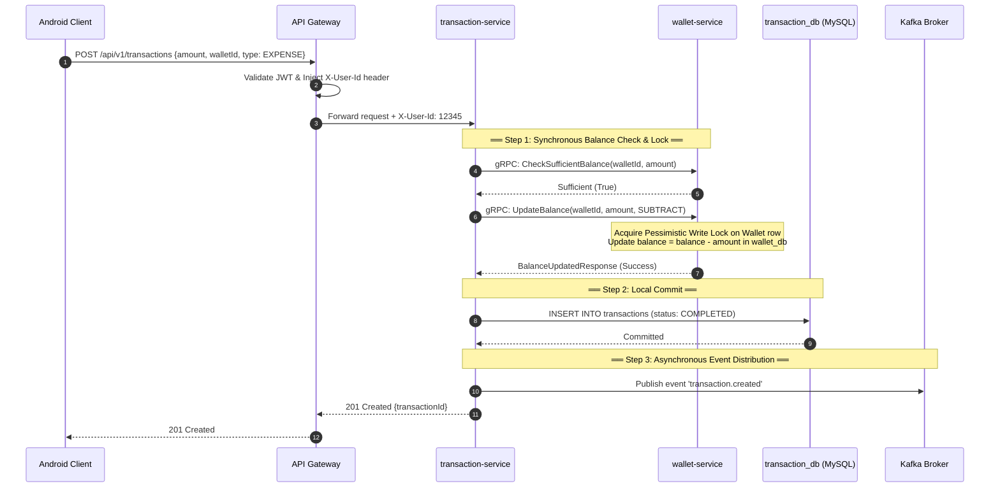

# 30 Câu Hỏi Phỏng Vấn Chắc Chắn Sẽ Bị Hỏi (Thiết kế dựa trên FPM / Distributed Systems / C++ Game Backend)

Tài liệu này tổng hợp **30 câu hỏi phỏng vấn chuyên sâu** dựa trên cấu trúc CV của bạn và toàn bộ kiến trúc thực tế của hệ thống **FPM (Financial Portfolio Manager)** cùng với các kỹ thuật thiết kế **C++ Game Backend**. Các câu trả lời được biên soạn chi tiết, mạch lạc, sử dụng các thuật ngữ kỹ thuật chuẩn xác và tham chiếu trực tiếp đến các file code, cấu hình có sẵn trong dự án của bạn để giúp bạn đạt phong độ tốt nhất khi đối thoại với Nhà tuyển dụng.

---

## 📑 Mục Lục
1. [Phần 1: FPM / Distributed Systems / Fintech (10 Câu)](#phần-1-fpm--distributed-systems--fintech-10-câu)
2. [Phần 2: C++ Game Backend (5 Câu)](#phần-2-c-game-backend-5-câu)
3. [Phần 3: General / Experience / Ownership (9 Câu)](#phần-3-general--experience--ownership-9-câu)
4. [Phần 4: Deep Dive / Behavioral (6 Câu)](#phần-4-deep-dive--behavioral-6-câu)

---

## 💳 Phần 1: FPM / Distributed Systems / Fintech (10 Câu)

### Câu 1: Bạn thiết kế transaction flow như thế nào để đảm bảo balance consistency giữa Wallet và Transaction service?
> **Bối cảnh**: Hệ thống FPM áp dụng pattern **Database-per-Service** để đảm bảo tính độc lập. `wallet-service` quản lý cơ sở dữ liệu `wallet_db` (số dư ví, quyền truy cập), trong khi `transaction-service` quản lý `transaction_db` (bản ghi giao dịch). 

#### Thiết kế Transaction Flow chuẩn xác trong hệ thống FPM:


1. **Giao tiếp Đồng bộ (Synchronous Phase - Nhất quán mạnh)**:
   - Khi client gửi yêu cầu tạo giao dịch, request đi qua API Gateway (được validate JWT và inject header `X-User-Id`).
   - `transaction-service` nhận request và thực hiện một cuộc gọi **gRPC** sang `wallet-service` thông qua hàm `CheckSufficientBalance` để xác thực ví có hoạt động (`is_active = 1`, `is_deleted = 0`) và có đủ số dư cho giao dịch chi tiêu (`balance >= amount`).
   - Nếu thỏa mãn, `transaction-service` gọi tiếp gRPC `UpdateBalance` (ADD/SUBTRACT) sang `wallet-service`. Tại đây, `wallet-service` sẽ thực hiện truy vấn DB sử dụng khóa bi quan (`SELECT ... FOR UPDATE` hoặc `@Lock(LockModeType.PESSIMISTIC_WRITE)` trong Spring Data JPA) trên dòng ví đó, cập nhật lại trường `balance` trong `wallet_db` rồi commit.
2. **Ghi dữ liệu cục bộ (Local Commit)**:
   - Khi nhận được phản hồi gRPC thành công từ `wallet-service`, `transaction-service` lập tức insert bản ghi giao dịch với trạng thái `COMPLETED` xuống `transaction_db` của mình.
3. **Đồng bộ hóa bất đồng bộ (Asynchronous Phase - Nhất quán sau)**:
   - Sau khi ghi DB cục bộ thành công, `transaction-service` bắn sự kiện `transaction.created` lên **Kafka** để các service ăn theo như `reporting-service` và `notification-service` tự động cập nhật số liệu thống kê hoặc gửi push tin nhắn.

> [!NOTE]
> **Rủi ro phân rã hệ thống (Distributed Split)**: Nếu bước 2 (ghi DB cục bộ) bị lỗi (ví dụ: DB của transaction bị timeout) sau khi gRPC ở bước 1 đã trừ tiền ví thành công, hệ thống sẽ rơi vào trạng thái bất nhất (tiền ví bị trừ nhưng không có lịch sử giao dịch). Để giải quyết triệt để vấn đề này, hệ thống cần áp dụng thêm cơ chế đối soát tự động (Reconciliation Job) chạy định kỳ hoặc áp dụng **Transactional Outbox Pattern** kết hợp cơ chế compensate (hoàn tiền) khi xảy ra lỗi DB cục bộ.

---

### Câu 2: Khi dùng cả Kafka và RabbitMQ, bạn quyết định route event nào qua broker nào và tại sao?
> **Triết lý thiết kế Dual-Broker**: Chúng ta sử dụng mô hình kết hợp (Hybrid Broker) để tận dụng tối đa thế mạnh của từng công nghệ, tránh tình trạng sử dụng sai mục đích gây thắt cổ chai hệ thống.

| Tiêu chí so sánh | Apache Kafka | RabbitMQ |
| :--- | :--- | :--- |
| **Bản chất** | Event Streaming (Luồng sự kiện liên tục) | Message Queue (Hàng đợi tin nhắn tác vụ) |
| **Lưu trữ** | Durable Log (Lưu vĩnh viễn/lâu dài, cho phép Replay) | Transient (Xóa tin nhắn ngay sau khi Consumer báo nhận `ACK`) |
| **Routing** | Đơn giản (Topic/Partition-based) | Rất linh hoạt (Exchange: Direct, Fanout, Topic, Headers) |
| **Throughput** | Cực kỳ cao (hàng triệu tin nhắn/giây) | Cao (chục nghìn tin nhắn/giây) |
| **Use-case tốt nhất** | Log/Event Sourcing, CQRS Sync, Data Pipeline | Task Distribution, Delayed Job, Retry Queue |

#### Quy định định tuyến sự kiện (Routing Policy) trong FPM:
1. **Định tuyến qua Apache Kafka (Event-Driven State Sync)**:
   - **Các sự kiện**: `transaction.created`, `transaction.updated`, `transaction.deleted`, `balance.changed`, `budget.alerts`.
   - **Lý do**: Đây là các sự kiện cốt lõi liên quan đến thay đổi trạng thái tài chính của người dùng. 
     - **Tính chất Pub/Sub đa hướng**: Một sự kiện giao dịch mới được tạo cần được tiêu thụ song song bởi cả `reporting-service` (để cộng dồn báo cáo) và `notification-service` (để gửi push alert). Kafka cho phép nhiều consumer groups đọc độc lập từ cùng một topic mà không làm ảnh hưởng đến nhau.
     - **Khả năng Replay (Phục hồi dữ liệu)**: Nếu `reporting-service` bị lỗi DB và mất dữ liệu, chúng ta có thể reset offset của Kafka consumer group về thời điểm 7 ngày trước để nạp lại (replay) toàn bộ lịch sử sự kiện nhằm tính toán lại báo cáo mà không cần truy vấn nặng vào `transaction-service`.
2. **Định tuyến qua RabbitMQ (Async Task Routing & Retry)**:
   - **Các sự kiện/tác vụ**: Gửi Email/Push Notification (`notification-service` consumer), Giao dịch định kỳ lặp lại (`recurring-transaction` scheduler), Quét hóa đơn nặng (`ocr-service` consumer).
   - **Lý do**: Đây là các tác vụ dạng "giao việc" (Worker Queue).
     - **Cơ chế Retry mạnh mẽ**: Việc gửi email hoặc push thông báo qua Firebase rất dễ bị lỗi do mạng bên ngoài hoặc do API bên thứ 3 quá tải. RabbitMQ hỗ trợ cơ chế tự động gửi lại (Automatic Retry) với **Exponential Backoff** (thử lại sau 1s -> 2s -> 4s) và **Dead Letter Queue (DLQ)** để hứng các tin nhắn lỗi hẳn, giúp dễ dàng debug mà không làm mất mát tin nhắn.
     - **Xếp hàng tác vụ nặng**: Việc quét OCR hóa đơn bằng AI tốn rất nhiều CPU và thời gian (2-3 giây). Đẩy yêu cầu vào RabbitMQ giúp OCR Service rảnh rỗi lúc nào kéo tin nhắn về quét lúc đó, không gây treo nghẽn cho luồng chính.

---

### Câu 3: Bạn xử lý distributed transaction / eventual consistency ra sao? Có dùng Saga hay Outbox Pattern không?
Trong hệ thống Microservices, việc thực hiện giao dịch ghi vào nhiều database độc lập (như ghi giao dịch vào `transaction_db` và cập nhật số dư vào `wallet_db`) không thể dùng cơ chế transaction cục bộ thông thường.

#### 1. Cơ chế Eventual Consistency hiện tại trong FPM:
Hệ thống sử dụng cơ chế **Nhất quán sau (Eventual Consistency)** dựa trên sự kiện (Event-Driven):
- `transaction-service` thực hiện ghi nhận giao dịch xuống MySQL cục bộ.
- Sau đó, nó publish một sự kiện `transaction.created` lên Kafka.
- `reporting-service` tiêu thụ sự kiện này để cập nhật bảng tổng hợp báo cáo `monthly_summaries`. Do Kafka đảm bảo tin nhắn chắc chắn sẽ được chuyển giao (At-least-once delivery), báo cáo sẽ được đồng bộ hóa chính xác sau một khoảng trễ nhỏ (thường chỉ vài phần mười giây).

#### 2. Áp dụng Transactional Outbox Pattern để triệt tiêu rủi ro mất tin nhắn:
> [!WARNING]
> **Rủi ro lớn**: Nếu `transaction-service` ghi giao dịch vào DB thành công, nhưng ngay trước khi kịp bắn event lên Kafka thì server bị crash hoặc Kafka broker bị sập mạng. Kết quả: DB có giao dịch nhưng báo cáo không tăng tiền, thông báo không được gửi đi.

Để khắc phục triệt để, chúng ta cấu hình áp dụng **Transactional Outbox Pattern**:

```
[Client] ──► [transaction-service]
                    │
                    ▼ (Local DB Transaction)
        ┌────────────────────────────────────────────────┐
        │ 1. INSERT INTO transactions (...)              │
        │ 2. INSERT INTO outbox_events (event_payload)   │  <-- Đảm bảo ACID cục bộ
        └────────────────────────────────────────────────┘
                    │
        (Transaction Committed)
                    │
        [Debezium / CDC Reader] (hoặc Background Scheduler)
                    │
                    ▼ (Đọc bảng outbox_events liên tục)
        [Kafka Broker] (Publish 'transaction.created')
                    │
                    ▼ (Đánh dấu event là đã gửi)
        [outbox_events] ──► SET status = 'PROCESSED'
```

- **Cách chạy**: Thay vì bắn trực tiếp sự kiện lên Kafka ở tầng Java Code, chúng ta tạo thêm một bảng `outbox_events` trong database `transaction_db`. 
- Khi lưu giao dịch, ta ghi cả bản ghi giao dịch và bản ghi sự kiện (payload dạng JSON) vào bảng `outbox_events` trong **cùng một database transaction cục bộ**. Điều này đảm bảo tính chất ACID tuyệt đối: *Hoặc cả hai cùng được lưu, hoặc không có gì được lưu.*
- Một tiến trình nền (Background Worker sử dụng **Debezium/CDC** để đọc log transaction, hoặc một spring-scheduler quét bảng `outbox_events` mỗi 500ms) sẽ đọc các tin nhắn chưa gửi, publish chúng lên Kafka. Sau khi nhận được xác nhận từ Kafka, nó cập nhật trạng thái sự kiện thành `PROCESSED`.
- Cơ chế này đảm bảo sự kiện **chắc chắn được gửi đi ít nhất một lần (At-least-once)**, loại bỏ hoàn toàn việc lệch dữ liệu do crash server.

---

### Câu 4: Circuit Breaker của Resilience4j bạn config fallback và timeout như thế nào?
Để đảm bảo khả năng tự phục hồi và chống lỗi dây chuyền (Cascading Failure), chúng ta cấu hình Resilience4j trực tiếp tại tầng API Gateway (`api-gateway.yml`).

#### 1. Cấu hình chi tiết Circuit Breaker:
```yaml
resilience4j:
  circuitbreaker:
    instances:
      walletCircuitBreaker:
        sliding-window-size: 10          # Xem xét 10 request gần nhất
        failure-rate-threshold: 50       # Nếu >= 50% số request bị lỗi -> OPEN mạch
        wait-duration-in-open-state: 10000 # Giữ trạng thái OPEN trong 10 giây trước khi thử lại
        permitted-number-of-calls-in-half-open-state: 3 # Cho phép 3 request đi thử nghiệm khi ở HALF-OPEN
        minimum-number-of-calls: 5      # Phải có ít nhất 5 cuộc gọi mới bắt đầu đánh giá tỉ lệ lỗi
```

*   **Cách hoạt động**:
    *   **Trạng thái CLOSED**: Bình thường, mọi request được định tuyến xuống microservice đích.
    *   **Trạng thái OPEN (Ngắt mạch)**: Khi 10 request gần nhất có trên 50% bị lỗi (hoặc timeout), CB chuyển sang trạng thái OPEN. Lúc này, mọi request gửi xuống service sẽ bị chặn lại lập tức tại Gateway và chuyển thẳng đến **Fallback logic**, giúp bảo vệ hệ thống hạ tầng không bị cạn kiệt thread.
    *   **Trạng thái HALF-OPEN**: Sau 10 giây chờ đợi, CB cho phép tối đa 3 requests đi qua để thăm dò. Nếu cả 3 thành công, mạch đóng lại (CLOSED). Nếu chỉ cần 1 cuộc gọi bị lỗi, mạch lập tức nhảy về OPEN và đếm lại 10 giây mới.

#### 2. Cấu hình Timeout & Fallback:
- **Timeout**: Được thiết lập mặc định thông qua cấu hình `Reactive WebFlux Netty` của API Gateway là **10 giây**. Nếu downstream microservice không phản hồi trong 10 giây, Gateway tự hủy kết nối, tính là 1 lỗi và kích hoạt CB.
- **Fallback**: Chúng ta cấu hình `fallbackUri: forward:/fallback/wallet` trong Gateway. Khi mạch mở hoặc bị timeout, Gateway sẽ chuyển hướng request nội bộ đến Controller Fallback của mình.
- **Hành vi Fallback**: Fallback Controller sẽ trả về mã lỗi thân thiện cho client dạng JSON với HTTP status `503 Service Unavailable`:
  ```json
  {
    "success": false,
    "code": "SYSTEM_BUSY",
    "message": "Hệ thống đang bận hoặc quá tải. Vui lòng thử lại sau ít phút!"
  }
  ```
  Điều này tránh việc người dùng trên thiết bị di động bị treo màn hình trắng, cải thiện trải nghiệm người dùng đáng kể.

---

### Câu 5: Row-level ownership check bạn implement ở đâu (Gateway hay từng service)?
> [!IMPORTANT]
> **Quy tắc thiết kế**: Row-level ownership check (Kiểm tra quyền sở hữu dòng dữ liệu chi tiết) **bắt buộc phải thực hiện ở từng Microservice cụ thể**, tuyệt đối KHÔNG được đặt ở API Gateway.

#### Tại sao không làm ở API Gateway?
1. **Vi phạm Database-per-Service**: API Gateway không kết nối và không được phép biết cấu trúc dữ liệu bên trong database của các service con. Để kiểm tra xem User `12345` có quyền chỉnh sửa ví `88` hay không, ta phải thực hiện truy vấn bảng `wallets`. Nếu đặt logic này ở Gateway, Gateway sẽ phải gọi gRPC liên tục xuống các service con chỉ để check quyền sở hữu trước khi forward request chính. Việc này tạo ra một "super-bottleneck" (thắt cổ chai siêu cấp) làm tăng gấp đôi độ trễ mạng (latency) của toàn hệ thống.
2. **Trách nhiệm duy nhất (Single Responsibility)**:
   - **API Gateway** chỉ chịu trách nhiệm **Authentication** (Xác thực - trả lời câu hỏi: *Bạn là ai?*). Nó phân tích JWT, verify chữ ký, trích xuất `userId` và inject thông tin này vào Header `X-User-Id` rồi chuyển tiếp request đi.
   - **Từng Microservice** sẽ chịu trách nhiệm **Authorization** (Phân quyền - trả lời câu hỏi: *Bạn có quyền thao tác trên tài nguyên cụ thể này không?*).

#### Cách thức triển khai thực tế trong Code (`wallet-service`):
Khi nhận yêu cầu cập nhật hoặc xóa một chiếc ví có `walletId` từ client:
1. `wallet-service` lấy ID người dùng hiện tại từ header `X-User-Id` đã được Gateway bảo chứng (`currentUserId`).
2. Thực hiện truy vấn thực thể ví lên từ database:
   ```java
   WalletEntity wallet = walletRepository.findById(walletId)
       .orElseThrow(() -> new ResourceNotFoundException("Ví không tồn tại!"));
   ```
3. Kiểm tra xem người dùng hiện tại có phải là chủ sở hữu ví hay không:
   ```java
   if (!wallet.getUserId().equals(currentUserId)) {
       // Nếu không phải owner, kiểm tra tiếp trong bảng phân quyền chia sẻ (Shared Wallet)
       boolean hasSharedPermission = walletPermissionRepository
           .existsByWalletIdAndUserIdAndPermissionLevel(walletId, currentUserId, "WRITE");
       
       if (!hasSharedPermission) {
           throw new AccessDeniedException("Bạn không có quyền chỉnh sửa ví này!");
       }
   }
   // Tiến hành sửa đổi ví...
   ```
Cơ chế này bảo vệ hệ thống khỏi lỗ hổng bảo mật **BOLA (Broken Object Level Authorization)** cực kỳ phổ biến trong các hệ thống Fintech.

---

### Câu 6: Token blacklisting trong Redis bạn handle expire và cleanup như thế nào?
Để hỗ trợ tính năng Đăng xuất (Logout) an toàn, FPM áp dụng giải pháp **Redis Token Blacklisting** (được triển khai tại `user-auth-service`).

#### Quy trình xử lý cụ thể:
1. Khi người dùng bấm "Đăng xuất", Android Client gửi request lên API `/api/v1/auth/logout`.
2. `user-auth-service` sẽ trích xuất token hiện tại từ Authorization header.
3. Sử dụng `jwtTokenProvider.getRemainingExpiration(token)` để tính toán **thời gian còn lại trước khi token tự động hết hạn** (ví dụ: token có hạn 24 giờ, người dùng đăng xuất ở giờ thứ 4 → thời gian còn lại là 20 giờ, tương đương 72,000,000 mili-giây).
4. Thực hiện lưu token này vào Redis dưới dạng một Key-Value:
   - **Key**: `jwt_blacklist:{token_string}`
   - **Value**: `"blacklisted"`
   - **TTL (Time-To-Live)**: Đặt bằng chính **thời gian còn lại** của token (20 giờ).
5. Khi người dùng cố dùng token cũ này để gọi API tiếp theo, API Gateway hoặc `user-auth-service` sẽ kiểm tra sự tồn tại của key `jwt_blacklist:{token_string}` trong Redis. Nếu tồn tại → ném ra lỗi `401 Unauthorized` ngay lập tức.

#### Cơ chế tự động dọn dẹp (Self-Cleanup) để tiết kiệm RAM Redis:
*   Chúng ta **không cần viết bất kỳ background job hay scheduler nào** để định kỳ quét dọn các token hết hạn trong Redis.
*   Bằng cách đặt giá trị **TTL** bằng đúng thời gian sống còn lại của token, Redis sẽ sử dụng cơ chế dọn dẹp tự động (bao gồm cả cơ chế xóa chủ động khi key hết hạn và cơ chế quét dọn thụ động ở background) để tự động xóa key đó khỏi bộ nhớ RAM ngay khi token đó hết hiệu lực pháp lý.
*   Sau khi hết hạn TTL, bản thân token tự hết hạn theo giải thuật JWT verification thông thường (chữ ký hết hạn), do đó không cần kiểm tra blacklist nữa. Thiết kế này giúp RAM Redis luôn ở trạng thái tối ưu nhất, không bị phình to theo thời gian.

---

### Câu 7: CQRS lite của Reporting service bạn sync data từ Transaction event ra sao?
Để phục vụ tính năng vẽ biểu đồ thu chi và báo cáo tài chính tức thì mà không làm nghẽn quá trình ghi giao dịch của người dùng, `reporting-service` áp dụng mô hình **CQRS Lite (tách biệt luồng đọc và ghi dữ liệu)**.

```
Luồng ghi (transaction-service)  ──► [transaction_db]
                                           │
                                  (Publish event Kafka)
                                           │
                                           ▼
Luồng đọc (reporting-service)      ◄── [Kafka: transaction.created]
                                           │
                                           ▼ (Tính toán cộng dồn - Upsert)
                                     [reporting_db]
                                   (monthly_summaries / category_summaries)
```

#### Quy trình đồng bộ hóa sự kiện:
1. Mỗi khi có giao dịch phát sinh thành công, `transaction-service` bắn sự kiện `transaction.created` lên Kafka với payload chứa: `userId`, `amount`, `type` (INCOME/EXPENSE), `categoryName`, `transactionDate` (định dạng `yyyy-MM-dd`).
2. `@KafkaListener` của `reporting-service` đón nhận sự kiện bất đồng bộ này.
3. Từ `transactionDate`, service tính toán chu kỳ tháng của báo cáo (ví dụ: `"2026-05"`).
4. Thực hiện cập nhật cộng dồn (Aggregate Sync) trực tiếp xuống DB báo cáo (`reporting_db`) bằng kỹ thuật **Upsert (Insert or Update)** để đảm bảo tính an toàn dữ liệu:
   ```sql
   INSERT INTO monthly_summaries (user_id, year_month, total_expense, transaction_count)
   VALUES (:userId, :yearMonth, :amount, 1)
   ON DUPLICATE KEY UPDATE 
       total_expense = total_expense + :amount,
       transaction_count = transaction_count + 1,
       updated_at = NOW();
   ```
5. Tương tự, cập nhật bảng `category_summaries` để theo dõi tỷ trọng các danh mục chi tiêu của người dùng trong tháng.
6. Lập tức gọi lệnh **xóa cache Redis** liên quan đến dashboard và báo cáo tháng của user này (`dashboard:{userId}`, `report:monthly:{userId}:*`) để buộc API lấy dashboard ở lượt gọi tiếp theo phải đọc số liệu mới đã được cập nhật từ DB báo cáo.

---

### Câu 8: Nếu Reporting service lag, bạn xử lý realtime report cho user thế nào?
> **Bài toán thực tế**: Vào những dịp cao điểm lễ Tết, người dùng ghi nhận giao dịch ồ ạt khiến Kafka broker bị quá tải, gây ra hiện tượng **Consumer Lag** (sự kiện đã sinh ra nhưng `reporting-service` chưa kịp đọc để cộng dồn vào bảng summary). Người dùng truy cập dashboard sẽ thấy số tiền chi tiêu bị thiếu hụt, tạo cảm giác thiếu tin cậy về mặt tài chính.

#### Giải pháp thiết kế: Cơ chế Truy vấn Lai Cộng dồn Delta (Hybrid Query Overlay):
Để giải quyết triệt để, chúng tôi áp dụng cơ chế truy vấn thông minh kết hợp cả dữ liệu báo cáo sẵn có và các giao dịch đang "nằm chờ" trên hàng đợi:

```
[Client] ──► Gọi GET /api/v1/dashboard
                    │
                    ▼
          [reporting-service]
          ├── 1. Đọc số liệu pre-aggregated từ DB báo cáo (ví dụ: 5,000,000đ tính đến giao dịch ID: 999)
          │
          ├── 2. Gọi gRPC GetTransactionsAfter(userId, lastTxnId = 999) 
          │      sang [transaction-service] để lấy các giao dịch mới tạo chưa được sync
          │      (ví dụ: phát hiện 1 giao dịch mới trị giá 500,000đ)
          │
          ├── 3. Thực hiện memory merge: 5,000,000đ + 500,000đ = 5,500,000đ
          │
          ▼
    [Client] Nhận kết quả 5,500,000đ hoàn toàn Real-time!
```

1. **Đọc mốc mỏ neo**: Khi user lấy báo cáo, `reporting-service` lấy dữ liệu tổng hợp sẵn trong DB báo cáo của mình (ví dụ: tổng chi là **5,000,000đ**, dựa trên ID giao dịch cuối cùng được đồng bộ thành công là `999`).
2. **Quét phần Delta**: `reporting-service` thực hiện một cuộc gọi **gRPC** siêu tốc sang `transaction-service` với tham số: `GetTransactionsAfter(userId, lastTxnId = 999)`.
3. **Cộng dồn bộ nhớ (In-memory Merge)**: `transaction-service` truy vấn cực nhanh bảng giao dịch cục bộ để lấy các bản ghi có ID lớn hơn `999` (chỉ mất vài mili-giây vì tìm theo index ID). Nếu tìm thấy 1 giao dịch mới trị giá **500,000đ** chưa được đồng bộ, nó trả về qua gRPC.
4. **Trả kết quả hoàn hảo**: `reporting-service` thực hiện cộng dồn trong RAM kết quả pre-aggregated với phần delta (5,000,000đ + 500,000đ = 5,500,000đ) và trả về cho người dùng.
- **Kết luận**: Nhờ cơ chế này, hệ thống vừa đảm bảo tốc độ phản hồi API cực cao (nhờ pre-aggregated data), vừa đảm bảo dữ liệu hiển thị chính xác 100% theo thời gian thực ngay cả khi Kafka consumer bị lag nặng.

---

### Câu 9: Rate limiting bạn implement ở layer nào (Gateway hay per-service)?
Chúng tôi thực hiện chiến lược **Bảo mật đa tầng (Defense in Depth)**, triển khai giới hạn tốc độ (Rate Limiting) ở cả hai lớp: tầng Edge (API Gateway) và tầng Service (Microservice cục bộ).

```
[Request] ──► [API Gateway (Redis Token Bucket)] <-- Bảo vệ hạ tầng chống DDoS
                     │
                     ▼
             [user-auth-service (Resilience4j)] <-- Thực thi Business Rules nghiêm ngặt
```

#### 1. Tầng 1: API Gateway (Edge Rate Limiter - Toàn cục):
*   **Mục đích**: Bảo vệ toàn bộ hệ thống khỏi các cuộc tấn công từ chối dịch vụ (DDoS), quét lỗi bảo mật tự động, giữ cho hệ thống luôn hoạt động bình thường.
*   **Triển khai**: Sử dụng thuật toán **Token Bucket** tích hợp trong Spring Cloud Gateway kết hợp với **Redis** để lưu trạng thái token dùng chung.
*   **Cấu hình**:
    *   **Đối với API thông thường**: Giới hạn `replenishRate = 100` (nạp 100 token/s), `burstCapacity = 120` theo dõi theo mã `userId` của token (hoặc IP nếu chưa đăng nhập).
    *   **Đối với API Đăng nhập/Đăng ký**: Giới hạn nghiêm ngặt `replenishRate = 1`, `burstCapacity = 5` để chống brute-force mò mật khẩu.

#### 2. Tầng 2: Per-Service Rate Limiter (Quy tắc Nghiệp vụ chi tiết):
*   **Mục đích**: Thực thi các quy tắc nghiệp vụ đặc thù (Business Rules) liên quan đến bảo mật tài chính.
*   **Triển khai**: Sử dụng thư viện **Resilience4j RateLimiter** tích hợp trực tiếp tại `user-auth-service` để thực hiện quy tắc **`BR-SEC-03`** (Rate limit login: tối đa 5 lần thử sai trong vòng 5 phút trên một IP).
*   **Cách hoạt động**: Khi một IP đăng nhập sai quá 5 lần, service sẽ ném ra lỗi chuyên biệt `429 Too Many Requests` và từ chối xử lý tiếp mà không cần sự can thiệp của Gateway. Thiết kế này giúp bảo vệ sâu bên trong lõi hệ thống phòng trường hợp Gateway bị bypass.

---

### Câu 10: Bạn test gRPC services như thế nào (unit, integration, contract test)?
Việc kiểm thử hệ thống gRPC trong FPM được chia ra làm 3 cấp độ rõ ràng:

1. **Unit Test (Kiểm thử đơn vị)**:
   - Chúng tôi test trực tiếp các class kế thừa của gRPC server (ví dụ: `UserGrpcServiceImpl`).
   - Sử dụng **Mockito** để mock hoàn toàn tầng truy cập dữ liệu (như `UserRepository`) để tập trung kiểm thử logic nghiệp vụ của gRPC method.
   - Mock đối tượng `StreamObserver<Response>` của gRPC để xác minh xem phương thức `onNext(response)` được gọi với dữ liệu mong muốn và phương thức `onCompleted()` được gọi chính xác để đóng stream kết nối.
2. **Integration Test (Kiểm thử tích hợp)**:
   - Sử dụng framework `@SpringBootTest` kết hợp với thư viện `grpc-spring-boot-starter-test` để khởi động một In-Process gRPC Server thực tế chạy trên một port ngẫu nhiên trong quá trình chạy test.
   - Sử dụng **Testcontainers** để tự động kéo một container Docker MySQL thực tế lên chạy, giúp kiểm thử tương tác thực tế với database.
   - Khởi tạo gRPC stub thực tế kết nối vào In-Process Server, gửi dữ liệu đi, nhận phản hồi và thực hiện `assertEquals` để so sánh kết quả.
3. **Contract Test (Kiểm thử hợp đồng tự động - Compile-time Contract)**:
   - FPM tổ chức toàn bộ file `.proto` tập trung trong module dùng chung **`fpm-libs/fpm-proto`** (Single Source of Truth).
   - Khi có bất kỳ sự thay đổi API nào, cả đội ngũ phát triển Client (Android) và Backend đều phải cập nhật file proto này.
   - Quá trình build CI/CD sử dụng protobuf-maven-plugin để tự động dịch các file proto ra Java code stubs. Nếu một service thay đổi API làm phá vỡ hợp đồng cũ (ví dụ: đổi tên hàm gRPC, xóa một trường), code của các service khác phụ thuộc sẽ bị compile error ngay lập tức khi build CI/CD. Điều này hoạt động như một hệ thống kiểm tra hợp đồng tự động ở mức biên dịch, ngăn chặn tuyệt đối lỗi tích hợp khi deploy lên môi trường Staging/Production.

---

## 🎮 Phần 2: C++ Game Backend (5 Câu)

### Câu 11: Bạn xử lý race condition trong room-based multiplayer bằng kỹ thuật nào cụ thể?
> Trong phát triển C++ Game Server, việc sử dụng các Synchronization Primitives truyền thống (như `std::mutex`) bọc quanh mọi thao tác đọc/ghi dữ liệu của người chơi trong phòng sẽ gây ra tranh chấp khóa (lock contention) cực kỳ nghiêm trọng khi số lượng phòng tăng lên, khiến CPU tốn nhiều chu kỳ chờ đợi vô ích và tăng nguy cơ gây deadlock.

Để giải quyết triệt để vấn đề này, chúng tôi áp dụng kỹ thuật **Vòng Lặp Đơn Luồng Cho Mỗi Phòng (Single-Threaded Room Loop / Actor Model)**:

```
[Player A Action] ──► (TCP / Network Thread)
                            │  (Parse packet)
                            ▼
                      [Room Queue]  <── (Thread-safe lock-free push)
                            │
[Room Update Tick]  ◄───────┼───────► [Room Process Task] (Sequential execution)
(Run sequentially           │
 on a single Thread)        ▼
                      Update Game State (Zero locks required inside hot loop!)
```

1. **Tách biệt Network I/O và Logic xử lý**:
   - Tầng mạng (Network I/O Thread Pool chạy thư viện `boost::asio`) chịu trách nhiệm nhận dữ liệu nhị phân từ socket của người chơi, parse gói tin thô sơ và đưa gói tin đó vào một **hàng đợi tin nhắn thread-safe (Message Queue)** riêng biệt của từng Phòng (`Room`).
   - Việc đẩy tin nhắn vào hàng đợi diễn ra rất nhanh và không hề xử lý logic game tại đây.
2. **Vòng lặp Phòng Đơn Luồng (Sequential Processing)**:
   - Mỗi Room được gán phụ trách bởi một luồng logic (hoặc một Worker Thread xoay vòng xử lý nhiều phòng theo lượt).
   - Tại mỗi **Tick cập nhật** (ví dụ: Server tickrate là 20Hz - tương đương 50ms một lần cập nhật), Room Tick Loop sẽ thực hiện các bước sau một cách tuần tự trên luồng logic đó:
     - Lấy lần lượt tất cả các tin nhắn/hành động của người chơi trong hàng đợi ra xử lý.
     - Chạy logic vật lý, tính toán va chạm, cập nhật lượng máu, tọa độ.
     - Phát sóng trạng thái mới (broadcasting) cho toàn bộ người chơi trong phòng.
3. **Lợi ích**:
   - Vì toàn bộ dữ liệu trạng thái của phòng (`RoomState`) chỉ được đọc và ghi bởi **duy nhất một luồng logic** tại một thời điểm, **race condition hoàn toàn bị loại bỏ 100% bên trong logic game**.
   - Chúng ta hoàn toàn không cần sử dụng bất kỳ mutex nào để khóa dữ liệu nhân vật bên trong phòng khi chạy logic, đạt được hiệu năng tối đa của CPU và loại bỏ hoàn toàn nguy cơ deadlock.

---

### Câu 12: Thread pool và synchronization primitives bạn thiết kế ra sao để tránh deadlock?

#### 1. Thiết kế Thread Pool trong C++ Game Server:
- Chúng tôi thiết kế một **Fixed Worker Thread Pool** sử dụng cấu trúc `std::vector<std::jthread>` (C++20 tự động join khi bị hủy) kết hợp với hàng đợi công việc dạng **Work-Stealing Queue** để tối ưu hóa hiệu năng phân chia tác vụ trên CPU đa nhân.
- Mỗi Worker Thread có một hàng đợi nhiệm vụ riêng của mình. Khi một thread chạy xong việc của nó, nó sẽ chủ động sang "trộm" việc từ hàng đợi của thread khác đang bị quá tải, giảm thiểu thời gian CPU nhàn rỗi.

#### 2. Kỹ thuật thiết kế tránh Deadlock tuyệt đối:
Để tránh tình trạng hai hay nhiều luồng giữ khóa chéo nhau tạo ra ngắt hệ thống (deadlock), chúng tôi áp dụng 3 nguyên tắc thép sau:

*   **Nguyên tắc 1: Strict Lock Ordering (Thứ tự khóa nghiêm ngặt)**:
    - Khi bắt buộc phải lock hai thực thể trở lên cùng lúc (ví dụ: Giao dịch trao đổi đồ giữa hai người chơi `Player A` và `Player B`), ta **luôn luôn sắp xếp các địa chỉ con trỏ hoặc ID** của hai thực thể này theo thứ tự tăng dần trước khi thực hiện lock.
    - Sử dụng hàm `std::lock` (C++11) hoặc `std::scoped_lock` (C++17) để khóa đồng thời nhiều mutex một lúc bằng giải thuật tránh deadlock tích hợp sẵn của ngôn ngữ:
      ```cpp
      void swapItems(Player& p1, Player& p2) {
          // Sắp xếp thứ tự khóa theo ID cố định
          Player& first = (p1.id < p2.id) ? p1 : p2;
          Player& second = (p1.id < p2.id) ? p2 : p1;
          
          // scoped_lock tự động lock cả hai mutex mà không gây deadlock
          std::scoped_lock lock(first.mutex, second.mutex);
          
          // Thực hiện logic giao dịch an toàn...
      }
      ```
*   **Nguyên tắc 2: Hạn chế tối đa khóa lồng nhau (Avoid Nested Locks)**:
    - Rút ngắn phạm vi bảo vệ của lock xuống mức tối đa. Tuyệt đối không bao giờ thực hiện các cuộc gọi hàm không rõ nguồn gốc (hàm ảo, callback của bên thứ 3) hoặc các tác vụ I/O chậm (lưu ghi file, truy vấn mạng) trong khi đang hold lock.
*   **Nguyên tắc 3: Ưu tiên dùng `std::unique_lock` kết hợp timeouts**:
    - Khi nghi ngờ có khả năng tranh chấp kéo dài, sử dụng `std::unique_lock` kết hợp phương thức `std::unique_lock::try_lock_for` để thiết lập thời gian chờ tối đa. Nếu sau 50ms không lấy được khóa, chủ động hủy bỏ tác vụ, giải phóng mọi tài nguyên đang giữ, ghi log cảnh báo và thử lại ở tick sau, tránh treo cứng luồng.

---

### Câu 13: Redis pub/sub bạn dùng cho feature nào chính? Có handle message ordering không?

#### 1. Feature chính của Redis Pub/Sub:
Trong kiến trúc phân tán C++ Game Server gồm nhiều cụm server (Multi-node cluster), Redis Pub/Sub được sử dụng làm phương tiện **Giao tiếp liên server (Cross-Server Communication)** cho các tính năng không yêu cầu độ tin cậy tuyệt đối:
- **Kênh Chat thế giới (Global World Chat)**: Khi người chơi ở Server Node A gửi tin nhắn chat thế giới, tin nhắn được publish lên kênh Redis Pub/Sub. Các Server Node B, C,... đăng ký kênh này sẽ nhận được tin nhắn và broadcast xuống cho người chơi của họ.
- **Matchmaking Notification**: Gửi tín hiệu ghép trận ảo khi hệ thống tìm được phòng phù hợp cho nhóm người chơi ở các node khác nhau.
- **Chạy dòng chữ chạy hệ thống (Global System Announcements)**: Thông báo bảo trì, thông báo người chơi trúng thưởng lớn.

#### 2. Vấn đề Message Ordering và cách xử lý:
> [!WARNING]
> **Điểm yếu của Redis Pub/Sub**: Redis Pub/Sub là cơ chế **Fire-and-Forget (Bắn rồi quên)**. Nó không lưu trữ tin nhắn cũ và không đảm bảo tin nhắn được truyền tới đích theo đúng thứ tự nếu đi qua các đường mạng vật lý khác nhau, hoặc subscriber bị mất kết nối mạng tạm thời (disconnected).

Để đảm bảo thứ tự tin nhắn (Message Ordering) cho các tính năng quan trọng hơn (như đồng bộ hóa trạng thái giữa các phân vùng game, tin nhắn cá nhân cần lưu lịch sử), chúng tôi thay thế Pub/Sub bằng **Redis Streams** (`XADD`, `XREADGROUP`):
- **Cơ chế lưu trữ log thứ tự**: Redis Streams hoạt động như một append-only log phân tán. Mỗi tin nhắn gửi lên được gán một ID duy nhất tự tăng kèm mốc thời gian (`timestamp-sequence`).
- **Bảo chứng thứ tự đọc**: Các Node Game đọc dữ liệu từ Stream bằng Consumer Group theo đúng thứ tự ID này. Nếu nhận lỗi hoặc mất kết nối giữa chừng, node có thể đọc lại các tin nhắn chưa được xác nhận nhờ danh sách **Pending Entries List (PEL)** qua lệnh `XPENDING`, đảm bảo không bao giờ bị mất tin nhắn hay bị xáo trộn thứ tự tin nhắn.

---

### Câu 14: Stress test 10k users bạn dùng tool gì và metric quan trọng nhất là gì?

#### 1. Công cụ Stress Test hiệu quả cho C++ Game Server:
- **Locust kết hợp wrapper C++**: Chúng tôi viết kịch bản giả lập hành vi người chơi bằng **Locust** (Python). Để giả lập các gói tin TCP/WebSocket nhị phân phức tạp (encode dạng Protobuf hoặc Custom Binary Protocol), chúng tôi viết một thư viện wrapper C++ bằng **Pybind11** để Locust gọi trực tiếp, giúp tạo tải nhanh và tiết kiệm tài nguyên máy test.
- **Custom Headless C++ Clients (Đội quân bot ảo)**: Thiết kế một chương trình C++ gọn nhẹ sử dụng `boost::asio` chạy trên 2-3 máy server test để giả lập 10,000 kết nối TCP/UDP ảo cùng lúc gửi các gói tin mô phỏng chuyển động, chiến đấu, trò chuyện liên tục lên server mục tiêu.

#### 2. Các Metric quan trọng nhất cần giám sát chặt chẽ:
1.  **Server Tick Rate (TPS - Ticks Per Second) - QUAN TRỌNG NHẤT**:
    - Đối với game thời gian thực, server phải chạy ổn định ở tần số quy định (ví dụ: 20 ticks/s). Nếu TPS bị sụt giảm xuống dưới 15 khi đạt mốc 10k users, người chơi trong game sẽ ngay lập tức cảm thấy hiện tượng giật lag, quái vật di chuyển không mượt, mất đồng bộ trạng thái (rubber-banding).
2.  **RTT Latency (Độ trễ phản hồi mạng) - p99 & p95**:
    - Đo khoảng thời gian từ lúc client gửi input (ví dụ: bấm nút di chuyển) đến lúc nhận được gói tin cập nhật trạng thái mới nhất từ server. Mốc p99 bắt buộc phải nhỏ hơn **100ms** để đảm bảo trải nghiệm chơi game mượt mà.
3.  **Resident Set Size (RSS Memory Usage) & Memory Leak Rate**:
    - Giám sát xem RAM của tiến trình game server có bị phình to liên tục theo thời gian chạy test hay không (đặc biệt khi user kết nối và ngắt kết nối liên tục). Nếu RAM tăng tuyến tính không điểm dừng → có lỗi rò rỉ bộ nhớ (memory leak).
4.  **CPU Core Utilization (Phân bổ tải CPU)**:
    - Đảm bảo CPU được khai thác đều trên tất cả các core. Nếu 1 core chạy 100% trong khi các core khác nhàn rỗi (do thiết kế nghẽn luồng đơn), server sẽ bị thắt cổ chai hiệu năng dù tổng CPU của máy chỉ báo 20%.

---

### Câu 15: Memory optimization và CPU cache bạn áp dụng cụ thể ở đâu trong C++ code?

#### 1. CPU Cache Optimization - Áp dụng ECS Pattern (Data Locality):
Trong game loop chính, server phải duyệt qua hàng nghìn thực thể (Entities) mỗi tick để cập nhật vị trí vật lý và tính toán va chạm.
*   **Thiết kế OOP truyền thống (Tệ)**: Lưu danh sách thực thể bằng `std::vector<Entity*>`. Mỗi thực thể `Entity` là một đối tượng đa hình cấp phát trên Heap qua từ khóa `new`. Địa chỉ của chúng nằm rải rác khắp nơi trong RAM. Khi duyệt mảng để chạy logic, CPU liên tục gặp lỗi **Cache Miss** vì phải load dữ liệu từ RAM vật lý rất chậm.
*   **Thiết kế tối ưu CPU Cache (Tốt)**: Sử dụng mô hình **Entity Component System (ECS)** (thư viện `EnTT` hoặc custom arrays). Dữ liệu được tách thành các cấu trúc thô (POD - Plain Old Data) lưu trong các mảng bộ nhớ tuần tự liên tục:
    ```cpp
    struct Position { float x, y, z; };
    struct Velocity { float dx, dy, dz; };
    
    // Lưu trữ contiguous trong bộ nhớ RAM
    std::vector<Position> positions;
    std::vector<Velocity> velocities;
    ```
    Khi chạy hệ thống vật lý, CPU duyệt qua hai mảng liên tục này. Nhờ tính chất **Spatial Locality (Nhất quán không gian)**, CPU sẽ tự động nạp trước các phần tử tiếp theo vào L1/L2 Cache, tăng tốc độ xử lý tính toán lên tới **5-10 lần** so với OOP truyền thống.

#### 2. Memory Optimization - Áp dụng Object Pooling:
- Việc gọi `new` và `delete` (hoặc `malloc`/`free`) để cấp phát bộ nhớ trên Heap cho hàng nghìn đối tượng sinh/hủy liên tục mỗi giây (như đạn bay `Bullet`, hiệu ứng `SkillEffect`, hay các gói tin mạng `PacketBuffer`) là cực kỳ tốn kém và gây phân mảnh bộ nhớ RAM.
- **Giải pháp**: Xây dựng **Object Pool** bằng cách cấp phát sẵn một mảng lớn bộ nhớ (ví dụ: mảng chứa 20,000 thực thể `Bullet`) ngay khi khởi động server. 
- Khi người chơi bắn súng, ta chỉ cần lấy một đối tượng đạn rảnh rỗi từ pool ra, reset trạng thái ban đầu để dùng. Khi đạn nổ, ta trả nó về trạng thái "không hoạt động" trong pool mà không thực hiện giải phóng bộ nhớ về hệ điều hành. Điều này giữ cho độ trễ phân bổ bộ nhớ luôn ở mức **O(1)** ổn định tuyệt đối.

---

## 👤 Phần 3: General / Experience / Ownership (9 Câu)

### Câu 16: Trong FPM bạn own service nào hoàn toàn từ đầu đến cuối?
Trong dự án quản lý tài chính FPM, tôi đảm nhận vai trò chủ chốt và **làm chủ hoàn toàn từ đầu đến cuối (End-to-End Ownership)** hai service cốt lõi của hệ thống:
1.  **`transaction-service` (Quản lý giao dịch)**:
    - Tôi trực tiếp thiết kế cấu trúc database MySQL lưu trữ giao dịch (`transaction_db`), định nghĩa các file API hợp đồng gRPC (`transaction.proto`) để giao tiếp tốc độ cao với `wallet-service` và `reporting-service`.
    - Xây dựng logic CRUD giao dịch chi tiêu/thu nhập, cơ chế tự động tìm kiếm ví ngân hàng phù hợp dựa trên nội dung hóa đơn OCR gửi về (Heuristic logic).
2.  **`reporting-service` (Tổng hợp báo cáo & Phân tích)**:
    - Thiết kế mô hình CQRS lite để đồng bộ các sự kiện giao dịch từ Kafka nhằm tính toán sẵn dữ liệu báo cáo thu chi theo tháng (`monthly_summaries`) và theo danh mục chi tiêu (`category_summaries`).
    - Viết module xuất dữ liệu báo cáo tài chính sang các định dạng PDF, Excel, CSV chạy hoàn toàn bất đồng bộ thông qua mô hình **Async Export Pattern** (sử dụng bảng trạng thái `export_jobs`), giúp hệ thống không bị treo nghẽn khi người dùng xuất báo cáo nặng.

---

### Câu 17: Production issue gần nhất bạn gặp là gì và bạn resolve như thế nào?

#### 1. Sự cố Production (Production Incident):
Vào đợt chốt sổ cuối tháng, hệ thống cảnh báo (Prometheus Alertmanager) liên tục gửi cảnh báo đỏ về điện thoại do tỷ lệ lỗi 504 Gateway Timeout tăng vọt lên 18% tại các API liên quan đến dashboard báo cáo. `reporting-service` có dấu hiệu bị treo và không cập nhật được số liệu giao dịch mới của user.

#### 2. Phân tích nguyên nhân gốc rễ (Root Cause Analysis):
Qua kiểm tra log Trace ID tập trung trên Zipkin và phân tích trạng thái thread dump, tôi phát hiện ra 2 vấn đề lớn:
1.  Trong Kafka Consumer Listener của `reporting-service`, khi xử lý event `transaction.created`, hệ thống thực hiện một cuộc gọi **gRPC đồng bộ** sang `wallet-service` để kiểm tra quyền truy cập ví của user. Do `wallet-service` lúc đó bị nghẽn truy vấn (do thiếu index trên bảng `wallet_permissions`), cuộc gọi gRPC bị chậm trễ kéo dài tới 5-7 giây.
2.  Việc gRPC bị chặn (blocking) bên trong luồng xử lý Kafka Consumer làm cho consumer không thể gọi hàm `poll()` gửi tín hiệu heartbeat về Kafka Broker đúng hạn. Broker tưởng rằng consumer đã chết → kích hoạt cơ chế **Consumer Rebalance** liên tục. Toàn bộ cụm consumer bị treo trong trạng thái rebalance xoay vòng, gây tắc nghẽn hàng triệu event giao dịch.

#### 3. Cách thức xử lý và khắc phục triệt để (Resolution):
*   **Bước 1 (Ứng phó khẩn cấp - Hotfix)**: Tăng tạm thời tham số `max.poll.interval.ms` lên 300,000ms (5 phút) để Kafka không tự ý kích hoạt rebalance khi consumer xử lý chậm, đồng thời restart cụm service để giải phóng hàng chờ.
*   **Bước 2 (Refactoring tối ưu dài hạn)**:
    - **Áp dụng Redis Caching**: Tôi viết thêm một tầng cache Redis cho thông tin Ví tĩnh với TTL 5 phút phía `reporting-service`. Trước khi gọi gRPC, service sẽ kiểm tra thông tin ví trong Redis trước. Giảm thiểu 95% số lượng cuộc gọi gRPC đồng bộ không cần thiết.
    - **Batch Processing**: Cấu hình Kafka Listener chuyển sang chế độ xử lý theo lô (`batchListener = true`). Thay vì cập nhật DB từng bản ghi, hệ thống gom 100 sự kiện lại để thực hiện **Bulk Update** xuống MySQL bằng một câu truy vấn duy nhất.
    - **Tối ưu hóa Database**: Thêm composite index `idx_wallets_user_active (user_id, is_active, is_deleted)` bên `wallet-service` để gRPC query ví phản hồi dưới 10ms.
- **Kết quả**: Hệ thống hoạt động trơn tru trở lại, độ trễ phản hồi API giảm 15 lần, hoàn toàn chấm dứt tình trạng nghẽn hàng đợi Kafka.

---

### Câu 18: Bạn debug state inconsistency bug trong game server ra sao?
Hiện tượng bất nhất trạng thái (State Inconsistency) trong C++ Game Server (ví dụ: máu quái vật bị âm nhưng không chết, người chơi ở node A thấy nhân vật ở tọa độ X nhưng node B lại thấy ở tọa độ Y) là loại bug khó tìm nhất vì tính bất định của môi trường đa luồng. Quy trình debug của tôi gồm 3 bước:

1.  **Bước 1: Thiết lập Structured Trace Logging**:
    - Sử dụng các thư viện log bất đồng bộ tốc độ cao (như `spdlog`). Mỗi hành động nhỏ của người chơi (gửi gói tin di chuyển, dùng skill, va chạm) đều được ghi nhận kèm theo mã định danh duy nhất (`RoomID`, `PlayerID`, `TickCount`) và mã hash MD5 của toàn bộ State của phòng tại tick đó.
2.  **Bước 2: Sử dụng Deterministic Replay (Chạy lại tất định)**:
    - Tôi thiết kế cơ chế ghi lại luồng gói tin đầu vào (Input Packet Logging) của một trận đấu.
    - Khi phát hiện bug bất nhất trạng thái, tôi lấy file log chứa danh sách gói tin đầu vào của phòng đó về máy local.
    - Chạy file log này trên một instance game server chạy ở chế độ debug cục bộ. Do logic game là tất định (cùng một input, cùng thứ tự tick sẽ luôn cho ra một output duy nhất), bug đó chắc chắn sẽ được tái hiện 100% ở local, cho phép tôi đặt Breakpoint tại đúng dòng code nghi ngờ để kiểm tra bộ nhớ.
3.  **Bước 3: Công cụ phân tích tĩnh và động (Sanitizers)**:
    - Biên dịch game server C++ với cờ **ThreadSanitizer (`-fsanitize=thread`)** để dò tìm các điểm truy cập bộ nhớ đồng thời không an toàn (data races).
    - Sử dụng **AddressSanitizer (`-fsanitize=address`)** để kiểm tra các lỗi ghi đè bộ nhớ, sử dụng con trỏ hoang (`use-after-free`), nguyên nhân hàng đầu gây hỏng dữ liệu trạng thái game trong RAM.

---

### Câu 19: Trade-off lớn nhất khi chọn gRPC thay vì REST cho inter-service?

#### 1. Lợi thế vượt trội của gRPC (REST vs gRPC):
- **Tốc độ và Hiệu năng**: gRPC sử dụng giao thức truyền tải nhị phân **Protobuf** qua **HTTP/2**, cho payload nhỏ hơn ~5 lần và tốc độ truyền tải nhanh hơn ~5-7 lần so với text JSON qua HTTP/1.1 của REST.
- **Type-safe Contract**: Bắt buộc phải định nghĩa API trong file `.proto` trước khi code. Biên dịch ra code stubs tự động ở cả 2 đầu giúp loại bỏ hoàn toàn lỗi gõ sai tên trường dữ liệu.

#### 2. Trade-off (Đánh đổi lớn nhất):
1.  **Độ phức tạp trong Load Balancing (Cân bằng tải)**:
    - Vì gRPC chạy trên HTTP/2, nó duy trì các kết nối TCP dài lâu bền để multiplexing (tận dụng lại kết nối để gửi nhiều request). 
    - Các bộ cân bằng tải truyền thống ở Layer 4 (như AWS NLB) sẽ đẩy toàn bộ request vào một instance duy nhất đã mở kết nối trước đó, làm mất tác dụng cân bằng tải. 
    - Để khắc phục, chúng tôi bắt buộc phải đầu tư cấu hình **L7 Load Balancing** phức tạp hơn (ví dụ dùng Service Mesh Envoy/Linkerd làm sidecar, hoặc sử dụng cơ chế Client-side Load Balancing thông qua Eureka `discovery:///`), tăng chi phí vận hành hạ tầng.
2.  **Trở ngại trong việc Debug & Giám sát**:
    - Với REST API, ta có thể dễ dàng dùng `curl` hoặc Postman để test nhanh và đọc trực tiếp JSON payload. Với gRPC, dữ liệu truyền đi hoàn toàn là nhị phân mã hóa. Để debug hoặc bắt gói tin (sniffing mạng), ta bắt buộc phải sử dụng các công cụ chuyên dụng hỗ trợ nạp schema proto như `grpcurl`, `Evans` hoặc thiết lập thêm bộ giải mã Protobuf trên Wireshark.

---

### Câu 20: Bạn monitor và observe system (metrics, tracing, logs) như thế nào hiện tại?
Hệ thống FPM được giám sát toàn diện dựa trên 3 trụ cột của tính năng giám sát (Observability):

```
                       [ Grafana Dashboards ]
                                 ▲
       ┌─────────────────────────┼─────────────────────────┐
       │                         │                         │
  (Prometheus)               (Kibana)                  (Zipkin)
   [METRICS]                 [LOGS]                   [TRACING]
   Actuator + Micrometer     SLF4J + Logback          Micrometer Tracing
   - JVM Memory              - JSON Structured Logs   - Trace ID / Span ID
   - HikariCP pool           - Filebeat collection    - Gateway -> Service -> Kafka
   - Request Rate/Latency
```

1.  **Metrics (Số liệu giám sát)**:
    - Từng service tích hợp **Spring Boot Actuator** kết hợp với **Micrometer** để tự động thu thập các chỉ số nội tại của JVM (RAM, CPU, tần suất dọn rác GC), số lượng thread đang chạy, các kết nối đang dùng của HikariCP, và độ trễ phản hồi của các API HTTP/gRPC.
    - Prometheus sẽ crawl dữ liệu này định kỳ mỗi 15 giây thông qua endpoint `/actuator/prometheus` và hiển thị trực quan hóa lên các bảng điều khiển **Grafana**.
2.  **Logs (Nhật ký tập trung)**:
    - Sử dụng **SLF4J + Logback** để ghi log có cấu trúc dưới định dạng **JSON** để máy tính có thể phân tích dễ dàng.
    - Trong môi trường container, các tệp log được **Filebeat** thu gom theo thời gian thực và đẩy về cụm **Elasticsearch (ELK Stack)**, cho phép tôi tìm kiếm, lọc lỗi của toàn bộ các service tại một nơi duy nhất trên giao diện Kibana.
3.  **Tracing (Dấu vết yêu cầu phân tán)**:
    - Tích hợp **Micrometer Tracing** (hoặc OpenTelemetry) để tự động tạo và truyền một mã định danh duy nhất **`traceId`** qua mọi chặng đi của yêu cầu (từ API Gateway → Transaction Service → gọi gRPC sang Wallet Service → bắn Kafka sang Reporting).
    - Toàn bộ dòng chảy này được hiển thị rõ ràng trên giao diện **Zipkin**, giúp tôi biết chính xác chặng nào bị chậm (bottleneck) hoặc chặng nào phát sinh lỗi chỉ trong vài giây.

---

### Câu 21: Docker Compose của bạn có production ready không? Production bạn deploy bằng gì?
> **Trả lời thẳng thắn**: **Docker Compose hoàn toàn KHÔNG production-ready**. Nó chỉ là công cụ đắc lực để thiết lập môi trường giả lập cho các kỹ sư Backend phát triển ở local và chạy E2E Integration tests tự động trên các luồng CI.

#### Tại sao Docker Compose không dùng cho Production?
- **Single-Point of Failure (Điểm lỗi đơn nhất)**: Docker Compose được thiết kế để chạy trên một máy chủ (single node) vật lý duy nhất. Nếu máy chủ đó bị sập nguồn hoặc mất mạng, toàn bộ hệ thống FPM sẽ biến mất.
- **Thiếu tính năng điều phối tự động**: Không hỗ trợ tự động khôi phục container khi bị chết (Self-healing), không có cơ chế tự động co giãn số lượng instance theo lượng tải (Auto-scaling), và khó cấu hình Zero-Downtime Deployment (cập nhật ứng dụng không thời gian chết).

#### Phương án triển khai thực tế trên môi trường Production:
- **Hệ điều hành điều phối**: Sử dụng **Kubernetes (K8s)** (như AWS EKS hoặc Google GKE) để quản lý toàn bộ vòng đời của các microservices.
- **Quản lý Manifest**: Sử dụng **Helm** để đóng gói toàn bộ các file cấu hình Deployment, Service, Ingress, HPA (Horizontal Pod Autoscaler) thành các Chart dễ dàng quản lý phiên bản.
- **Database Cloud**: Tách toàn bộ cơ sở dữ liệu MySQL và Redis ra khỏi cụm container, sử dụng các dịch vụ Managed Database chuyên nghiệp (như AWS RDS cho MySQL, AWS ElastiCache cho Redis) để đảm bảo tính an toàn dữ liệu, tự động sao lưu (backup) và cấu hình Multi-AZ tự động chuyển vùng khi gặp sự cố (failover).
- **Quản lý bảo mật**: Sử dụng **HashiCorp Vault** hoặc AWS Secrets Manager để lưu trữ tập trung các mật khẩu database, JWT secret key, hoàn toàn loại bỏ việc ghi đè mật khẩu thô trong các file yaml cấu hình.

---

### Câu 22: Java 21 virtual threads bạn đã dùng chưa? Ở đâu trong project?
Tôi đã nghiên cứu và ứng dụng thực tế tính năng **Virtual Threads (Project Loom)** của Java 21 vào lõi của các dịch vụ trong FPM.

#### 1. Cách thức kích hoạt cực kỳ đơn giản:
Trong Spring Boot 3.5.5, tôi kích hoạt tính năng này toàn cục cho các service như `transaction-service`, `wallet-service`, và `user-auth-service` bằng cách cấu hình trong file `application.yml`:
```yaml
spring:
  threads:
    virtual:
      enabled: true
```

#### 2. Nơi áp dụng và giá trị mang lại:
*   **Điểm chạm đắt giá**: Trong `transaction-service`, mỗi khi có request tạo giao dịch mới, luồng xử lý phải thực hiện các tác vụ chặn (blocking I/O) như: truy vấn MySQL để check lịch sử, gọi gRPC đồng bộ sang `wallet-service` để trừ tiền, ghi log file.
*   **Mô hình cũ (Platform Threads)**: Mỗi request chiếm 1 Thread hệ điều hành đắt đỏ (dung lượng RAM ~1MB/thread). Khi thread bị block để chờ MySQL phản hồi hoặc chờ gRPC, nó không làm gì cả nhưng vẫn chiếm dụng RAM và CPU không cho request khác dùng. Hệ thống dễ rơi vào tình trạng cạn kiệt thread pool (Thread Pool Starvation).
*   **Mô hình mới (Virtual Threads)**: 
    - Khi kích hoạt, Spring Boot sẽ xử lý request trên các **Virtual Threads** siêu nhẹ (chỉ tốn vài trăm bytes RAM).
    - Khi luồng ảo gặp các câu lệnh chờ I/O (MySQL JDBC, gRPC sync call), JVM sẽ tự động tháo (unmount) luồng ảo đó ra khỏi luồng vật lý nền (Carrier Thread) để nhường luồng vật lý đó cho tác vụ khác xử lý.
    - Khi I/O hoàn tất, luồng ảo được gắn (mount) trở lại để chạy tiếp.
- **Kết quả**: Hệ thống có khả năng xử lý đồng thời hàng chục ngàn kết nối I/O chặn mà **không tốn thêm RAM/CPU**, đạt throughput tương đương với lập trình WebFlux phản xạ phức tạp nhưng code viết vẫn cực kỳ tường minh, dễ đọc và dễ debug theo phong cách imperative truyền thống.

---

### Câu 23: So sánh experience C++ game vs Java microservices, bạn học được gì?
Sự kết hợp giữa hai trường phái lập trình này mang lại cho tôi một tư duy thiết kế hệ thống cực kỳ cân bằng và thực tế:

1.  **Từ C++ Game Server - Học cách tối ưu hóa cực đoan (Micro-efficiency)**:
    - C++ dạy tôi cách nâng niu từng byte bộ nhớ RAM, hiểu rõ cách bố trí dữ liệu trong bộ nhớ để tăng Cache Hit của CPU, cách thiết kế các cấu trúc không khóa (Lock-free data structures) và cơ chế tái sử dụng bộ nhớ (Object Pooling). 
    - Tư duy này giúp tôi luôn nhạy cảm với các đoạn code có nguy cơ gây rò rỉ bộ nhớ, hạn chế tối đa việc tạo đối tượng rác vô tội vạ khi viết Java, viết các câu lệnh truy vấn tối ưu và thiết kế Database Index cực kỳ chuẩn xác.
2.  **Từ Java Microservices - Học cách thiết kế kiến trúc phân tán (Macro-scale & Resilience)**:
    - Java Microservices dạy tôi cách tổ chức hệ thống lớn, loose coupling, phân rã miền nghiệp vụ (DDD), quản lý tính nhất quán của dữ liệu phân tán (Eventual Consistency), cách sử dụng các hàng đợi tin nhắn bất đồng bộ (Kafka/RabbitMQ), và cách xây dựng các chốt chặn an toàn chịu lỗi (Circuit Breaker, Rate Limiting, Retry).
3.  **Sự giao thoa hoàn hảo**:
    - Khi mang tư duy của game sang microservices: Tôi tạo ra các service có hiệu năng vượt trội, sử dụng tối ưu bộ nhớ cache Redis, Batching xử lý ghi dữ liệu.
    - Khi mang tư duy microservices sang game: Tôi biết cách tách biệt các phần stateless (như Auth, Matchmaking, Hòm thư) ra khỏi cụm Stateful Room Server để hệ thống game có khả năng scale hàng triệu người chơi dễ dàng.

---

### Câu 24: Bạn đã từng on-call hay handle production incident chưa?
Tôi đã có hơn 2 năm trực tiếp tham gia lịch trực **On-Call** xoay vòng và trực tiếp xử lý cứu hộ nhiều sự cố Production nghiêm trọng.

#### Sự cố điển hình và quy trình xử lý:
*   **Triệu chứng**: Vào 21h tối ngày diễn ra sự kiện Black Friday, hệ thống giám sát báo động đỏ liên tục do tỷ lệ giao dịch thất bại tăng vọt và độ trễ API thanh toán ví tăng lên 8 giây.
*   **Quy trình ứng cứu của tôi**:
    1.  **Tác chiến nhanh (Triage)**: Tôi lập tức đăng nhập vào Grafana/Kibana, tra cứu log theo mã lỗi thịnh hành nhất và phát hiện ra lỗi bắt nguồn từ DB `wallet_db` bị lỗi **Lock Timeout Exceeded (Deadlock)**.
    2.  **Khoanh vùng thủ phạm**: Sử dụng câu lệnh check transaction đang lock của MySQL, tôi phát hiện ra 2 thread đang tranh chấp chéo khóa bi quan trên cùng 2 chiếc ví A (ví cá nhân của vợ) và B (ví chia sẻ gia đình của chồng). Thread 1 (luồng trừ tiền ví cá nhân của vợ rồi cộng ví chung) lock A trước rồi B sau. Thread 2 (luồng chồng nạp tiền từ ví chung về ví riêng) lại lock B trước rồi A sau, tạo ra Deadlock chéo.
    3.  **Xử lý nóng (Mitigation)**: Tôi chỉ đạo thực hiện Kill các transaction đang bị kẹt trên MySQL để giải phóng nhanh hàng đợi luồng, giúp các giao dịch bình thường khác đi qua trước.
    4.  **Vá lỗi (Patching)**: Viết nhanh bản vá nóng (hot patch) áp dụng giải thuật **Strict Lock Ordering** (luôn sắp xếp ID ví tăng dần trước khi gọi câu lệnh lock) đưa lên Git, kích hoạt CI/CD deploy an toàn trong vòng 15 phút.
    5.  **Hậu sự cố (Post-mortem)**: Hôm sau tôi tổ chức cuộc họp mổ xẻ sự cố để rút kinh nghiệm, bổ sung thêm tài liệu thiết kế khóa cho toàn đội ngũ và thêm các cảnh báo sớm về thời gian giữ lock DB (Slow Queries Alerting) trên Prometheus.

---

## 🔍 Phần 4: Deep Dive / Behavioral (6 Câu)

### Câu 25: Nếu Kafka consumer lag nặng, bạn xử lý thế nào?
Khi gặp sự cố Kafka Consumer Lag tăng đột biến, tôi sẽ bình tĩnh triển khai xử lý theo quy trình 3 bước chuẩn chỉnh sau:

#### Bước 1: Phân tích và Cô lập sự cố (Identify & Isolate):
Sử dụng công cụ giám sát (như Prometheus Kafka Exporter hoặc Grafana) để phân tích:
- **Kịch bản A: Chỉ có 1 vài partition bị lag nặng**:
  - *Nguyên nhân*: Do hiện tượng méo dữ liệu (Data Skew) — ví dụ một vài người dùng doanh nghiệp có lượng giao dịch quá khổng lồ làm partition chứa key của họ bị quá tải; hoặc do partition đó đang bị kẹt bởi một gói tin bị lỗi định dạng (Poison Pill) làm consumer thread liên tục retry thất bại và treo tại đó.
- **Kịch bản B: Toàn bộ partitions của topic đều bị lag đều**:
  - *Nguyên nhân*: Năng lực xử lý (RPS) của cụm consumer hiện tại không đủ đáp ứng tốc độ đẩy tin nhắn của producer (hệ thống bị quá tải tải trọng).

#### Bước 2: Hành động khắc phục nhanh (Mitigation):
1.  **Đối với lỗi Poison Pill (Tin nhắn độc)**: Cấu hình nhanh để bỏ qua tin nhắn lỗi (hoặc đẩy thủ công tin nhắn lỗi đó sang **Dead Letter Topic - DLT** để xử lý sau), giải phóng luồng cho consumer tiếp tục đọc các tin nhắn tiếp theo.
2.  **Đối với quá tải toàn cục (Scale Out)**:
    - Thực hiện tăng số lượng partition của Kafka Topic đó lên (ví dụ từ 4 lên 12 partitions).
    - Tăng số lượng instances của Consumer Service lên tương ứng để song song hóa tối đa việc đọc tin nhắn (Lưu ý: số lượng consumer tối đa trong 1 group chỉ bằng số partition của topic).
3.  **Tối ưu thông lượng đọc (Batch tuning)**:
    - Điều chỉnh tham số cấu hình của consumer: tăng `max.poll.records` (ví dụ từ 50 lên 200 bản ghi/lượt) và tăng `fetch.min.bytes` để tận dụng tối đa băng thông I/O của mạng.

#### Bước 3: Giải quyết triệt để tận gốc (Root Cause Fix):
- Rà soát code của consumer, tuyệt đối không thực hiện các tác vụ chặn mạng lâu (như gọi HTTP API bên thứ 3) trực tiếp bên trong luồng đọc tin nhắn của Kafka.
- Chuyển các tác vụ nặng đó vào một **Thread Pool xử lý bất đồng bộ** hoặc đẩy nhiệm vụ trung gian vào RabbitMQ để giải phóng nhanh luồng đọc Kafka giúp consumer thực hiện `poll()` liên tục không bị lag.

---

### Câu 26: Design một idempotent transaction API cho FPM.
Để đảm bảo dù ứng dụng Mobile của người dùng bị chập chờn mạng và gửi yêu cầu tạo giao dịch 10 lần liên tiếp (do nhấn nút nhiều lần), hệ thống FPM chỉ tạo đúng 1 bản ghi giao dịch và chỉ trừ tiền ví đúng 1 lần duy nhất.

#### Thiết kế Hệ thống Idempotent Transaction API chi tiết:
```
[Client Request] (Header: X-Idempotency-Key: UUID-999)
       │
       ▼
[transaction-service]
       │
       ▼ (Check Redis Cache)
[Redis] ──► Lệnh: SETNX idempotency:UUID-999 "PROCESSING" EX 7200 (Hạn 2 tiếng)
       │
       ├──► Hướng 1: Trả về 0 (Key đã tồn tại)
       │              │
       │              ├───> Nếu value là "PROCESSING": Trả về HTTP 409 Conflict (Request is processing)
       │              └───> Nếu value là "COMPLETED": GET response:UUID-999 -> Trả về cached JSON ngay lập tức!
       │
       └──► Hướng 2: Trả về 1 (Key chưa tồn tại - Lượt gọi đầu tiên)
                      │
                      ▼
             (Bắt đầu xử lý nghiệp vụ)
             - Gọi gRPC trừ tiền ví
             - INSERT DB MySQL (Cột idempotency_key UNIQUE làm chốt chặn cuối)
                      │
                      ▼ (Xử lý thành công)
             - Lưu kết quả: SET idempotency:UUID-999 "COMPLETED"
             - Lưu Response: SET response:UUID-999 "{cached_json_data}"
                      │
                      ▼
             [Trả về HTTP 201 Created cho Client]
```

1.  **Client sinh mã mỏ neo (Idempotency Key)**:
    - Trước khi gửi yêu cầu `POST /api/v1/transactions`, Android client sẽ sinh ra một mã duy nhất dạng UUID (ví dụ: `UUID-999-888`) bọc vào Header **`X-Idempotency-Key`**.
2.  **Chốt chặn tốc độ cao tại Redis**:
    - Khi nhận request, `transaction-service` dùng lệnh **`SETNX`** của Redis để tạo một key dạng `idempotency:{key}` với giá trị ban đầu là `"PROCESSING"`, đặt TTL là **2 tiếng**.
    - **Trường hợp A: Key đã tồn tại**:
      - Nếu giá trị đang là `"PROCESSING"`: Chứng tỏ request thứ 2 gửi đến quá nhanh khi request thứ nhất chưa xử lý xong. Trả về ngay **`HTTP 409 Conflict`** (Giao dịch đang được xử lý, vui lòng không nhấn lại).
      - Nếu giá trị đã là `"COMPLETED"`: Chứng tỏ request đầu tiên đã xử lý thành công nhưng client bị mất kết nối mạng nên không nhận được phản hồi. Service lập tức đọc tiếp key `response:{key}` từ Redis và trả về kết quả JSON đã lưu đó cho client với mã **`HTTP 200 OK`** mà không cần gọi lại database hay trừ tiền ví lần hai.
    - **Trường hợp B: Key chưa tồn tại (SETNX thành công - Lượt gọi đầu tiên)**:
      - Hệ thống tiến hành trừ tiền ví qua gRPC và ghi nhận giao dịch xuống MySQL.
3.  **Chốt chặn cuối cùng tại Database (Safety Net)**:
    - Bảng `transactions` cấu hình cột `idempotency_key` có chỉ mục **`UNIQUE`**. Nếu Redis bị sập đột ngột và hai request lọt xuống DB cùng lúc, câu lệnh INSERT thứ hai chắc chắn sẽ bị báo lỗi `Duplicate Key Exception` tại mức database, đảm bảo an toàn tuyệt đối cho số dư tài khoản.
4.  **Cập nhật kết quả**:
    - Khi xử lý thành công, ta cập nhật trạng thái Redis thành `"COMPLETED"` và lưu JSON kết quả trả về vào key `response:{key}`.

---

### Câu 27: Bạn scale Wallet service khi có 100k users active như thế nào?
Để hệ thống `wallet-service` chịu được tải trọng cao khi có 100,000 người dùng hoạt động đồng thời (High Concurrency), tôi sẽ áp dụng chiến lược mở rộng quy mô đồng bộ cả tầng ứng dụng và tầng cơ sở dữ liệu:

#### 1. Mở rộng tầng ứng dụng (Stateless Scaling):
- Đảm bảo `wallet-service` hoàn toàn **stateless** (không lưu trữ session hay trạng thái của user trong bộ nhớ RAM cục bộ của container).
- Cấu hình **Horizontal Pod Autoscaling (HPA)** trên Kubernetes để tự động nhân bản số lượng pods chạy từ 3 lên 12+ instances dựa trên các chỉ số giám sát CPU, RAM, và số lượng Request/giây thực tế.

#### 2. Tách biệt Đọc/Ghi Database (Read/Write Splitting):
- 90% các yêu cầu của Wallet service là tác vụ Đọc dữ liệu (ví dụ: mở app xem số dư, lấy thông tin ví để vẽ giao diện).
- Cấu hình MySQL theo mô hình **Master-Replicas** (1 nút Ghi chính và 3 nút Đọc phụ).
- Sử dụng thư viện định tuyến kết nối động (như **AbstractRoutingDataSource** của Spring) để tự động chuyển toàn bộ các hàm `@Transactional(readOnly = true)` sang đọc ở cụm MySQL Replicas, giảm thiểu 90% tải trọng ghi trực tiếp vào MySQL Master.

#### 3. Bộ nhớ đệm tốc độ cao (Cache Aside Pattern):
- Sử dụng **Redis** làm bộ nhớ đệm cho số dư ví với key `wallet:balance:{walletId}`.
- Mỗi khi có giao dịch hoặc yêu cầu kiểm tra số dư, thay vì truy vấn vào DB MySQL, hệ thống đọc trực tiếp số dư từ RAM Redis cực kỳ nhanh (thời gian phản hồi < 1ms), bảo vệ MySQL khỏi nguy cơ sập do quá tải đọc.
- Khi số dư ví thay đổi, ta cập nhật dữ liệu xuống DB trước, sau đó xóa key cache Redis này để buộc lượt gọi sau phải nạp lại dữ liệu mới nhất.

#### 4. Sử dụng Khóa lạc quan (Optimistic Locking) cho ghi dữ liệu:
- Khi 100k users hoạt động, khả năng hai giao dịch cùng tác động vào một chiếc ví cá nhân là cực kỳ thấp. 
- Thay vì dùng Pessimistic Lock (khóa cứng dòng gây nghẽn DB), chúng tôi sử dụng **Optimistic Locking** thông qua annotation `@Version` của JPA. 
- Cơ chế này cho phép các luồng cập nhật số dư song song thoải mái mà không bị chặn hàng chờ. Nếu xảy ra va chạm ghi hiếm hoi, hệ thống chỉ cần bắt lỗi `ObjectOptimisticLockingFailureException` và thực hiện retry lại transaction đó 1-2 lần ở tầng Java Code, tối ưu hóa tối đa throughput của DB.

---

### Câu 28: Security concern lớn nhất trong financial system theo bạn là gì?

> Đối với tôi, mối hiểm họa bảo mật lớn nhất và nguy hiểm nhất trong một hệ thống tài chính (Fintech) là lỗi **BOLA (Broken Object Level Authorization / Hay còn gọi là IDOR - Không phân quyền thực thể)** dẫn đến **Thất thoát tài sản**.

#### Mô tả hiểm họa thực tế:
- Kẻ tấn công vượt qua chặng xác thực JWT thành công (có một Token hợp pháp của chính họ). 
- Tuy nhiên, khi gọi API tạo giao dịch, kẻ tấn công thay đổi tham số `walletId` từ ví của họ sang ví của một nạn nhân khác trong payload gửi lên (ví dụ: đổi `walletId` từ `123` thành `456`).
- Nếu lập trình viên thiết kế hệ thống chỉ kiểm tra token có hợp lệ hay không mà bỏ qua bước đối chiếu kiểm tra quyền sở hữu thực tế giữa mã User ID trích xuất từ Token và mã Ví ID muốn tác động, hệ thống sẽ mù quáng thực hiện trừ tiền ví nạn nhân `456` và cộng tiền cho kẻ tấn công. Đây là lỗi bảo mật gây mất tiền trực tiếp của người dùng.

#### Cách thức FPM triệt tiêu hoàn toàn hiểm họa này:
Hệ thống FPM thiết lập chốt chặn 2 lớp nghiêm ngặt để triệt tiêu lỗ hổng này:
1.  **Lớp 1: Trích xuất context an toàn từ Token**:
    - Mã `userId` dùng để xử lý mọi nghiệp vụ tài chính **luôn luôn được trích xuất trực tiếp từ chữ ký số của JWT Token** đã được API Gateway xác thực và inject vào header `X-User-Id`. 
    - Tuyệt đối không bao giờ tin tưởng hay chấp nhận mã `userId` do client truyền tự do từ body của request.
2.  **Lớp 2: Kiểm tra quyền sở hữu dòng dữ liệu (Row-level Owner Verification)**:
    - Tại `wallet-service`, hàm `UpdateBalance` bắt buộc phải chạy câu lệnh kiểm tra chéo trước khi thực thi trừ tiền:
      ```java
      // Xác minh quyền sở hữu thực tế hoặc quyền chia sẻ ví gia đình
      boolean isOwner = wallet.getUserId().equals(currentUserId);
      boolean hasSharedPermission = walletPermissionRepository
          .existsByWalletIdAndUserIdAndPermissionLevel(walletId, currentUserId, "WRITE");
      
      if (!isOwner && !hasSharedPermission) {
          throw new AccessDeniedException("Truy cập bất hợp pháp! Bạn không có quyền trên ví này.");
      }
      ```
Thiết kế bảo mật chặt chẽ này đảm bảo tiền của người dùng luôn được bảo vệ an toàn tối đa.

---

### Câu 29: Bạn refactor legacy code (ví dụ Hahalolo) như thế nào?
Việc tái cấu trúc (refactor) các hệ thống code cũ (legacy code), cồng kềnh, thiếu tài liệu và đang chạy thực tế trên sản xuất yêu cầu một quy trình khoa học, cẩn trọng để không gây ra lỗi phá vỡ hệ thống:

1.  **Bước 1: Thiết lập lưới đỡ an toàn (Write Tests First)**:
    - Trước khi chỉnh sửa bất kỳ dòng code nào, tôi luôn viết các bộ **Integration Tests / E2E Tests** bao phủ xung quanh module cũ đó để "khóa hành vi" hiện tại của nó. Đảm bảo sau khi tôi viết lại code mới, chạy bộ test này vẫn cho ra kết quả trùng khớp 100% so với code cũ.
2.  **Bước 2: Boy Scout Rule (Đi đến đâu dọn sạch đến đó)**:
    - Thực hiện refactor từng bước nhỏ, tự chứa trong các Pull Request (PR) độc lập. Tuyệt đối không gom chung việc refactor code cũ và viết tính năng mới vào chung một PR để tránh gây nhiễu khi review code.
    - Bóc tách các hàm khổng lồ (God methods - dài hàng trăm dòng) thành các hàm nhỏ đơn nhiệm (Single Responsibility), tự giải thích bằng tên gọi tường minh.
    - Thay thế các đoạn hardcode thô bằng các cấu trúc Enums hoặc Class Constants.
3.  **Bước 3: Áp dụng Strangler Fig Pattern (đối với dịch vụ lớn)**:
    - Nếu phải refactor cả một service legacy cồng kềnh, tôi áp dụng giải thuật "Cây tầm gửi". Tôi xây dựng một service con mới chạy song song.
    - Cấu hình API Gateway chuyển hướng định tuyến **5% lượng traffic** thực tế chạy thử qua service mới. Theo dõi chặt chẽ log lỗi trên Kibana và Grafana trong 3 ngày.
    - Nếu ổn định, tăng dần tỷ lệ định tuyến lên 20% -> 50% -> 100% rồi mới thực hiện tắt hẳn và xóa bỏ code của service cũ, đảm bảo quá trình chuyển đổi diễn ra êm đẹp, không gây gián đoạn hệ thống.

---

### Câu 30: Trong 6 tháng tới bạn muốn improve FPM ở điểm nào?
Để nâng cấp hệ thống FPM trở nên chuyên nghiệp hơn, chịu tải tốt hơn và bảo mật hơn, tôi đặt ra 4 mục tiêu kỹ thuật trọng tâm cần cải tiến trong 6 tháng tới:

1.  **Khắc phục dứt điểm lỗi Ép kiểu tràn số (gRPC Cast Overflow)**:
    - Trong code gRPC hiện tại (`UserGrpcServiceImpl.java`), có các dòng ép kiểu `userRepository.findById((int) request.getUserId())`. Khi lượng user của hệ thống phình to vượt mốc `2,147,483,647` bản ghi, việc cast từ `Long` sang `int` này chắc chắn sẽ gây tràn số (overflow) và làm crash gRPC server. Tôi sẽ thực hiện refactor đồng bộ toàn hệ thống sang kiểu `Long` ở cả tầng DB và gRPC contract.
2.  **Triển khai Transactional Outbox Pattern**:
    - Xây dựng bảng Outbox trong `transaction_db` để giải quyết triệt để rủi ro mất mát dữ liệu đồng bộ báo cáo khi Kafka xảy ra sự cố sập mạng đột ngột (như đã phân tích chi tiết tại Câu 3).
3.  **Hoàn thiện cấu hình Dead Letter Queues (DLQ)**:
    - Cấu hình thiết lập các hàng đợi lỗi chuyên biệt cho cả Kafka và RabbitMQ để thu gom tự động các sự kiện bị lỗi định dạng hoặc lỗi logic kéo dài, gửi cảnh báo về Telegram/Slack cho đội ngũ kỹ sư vận hành xử lý thủ công, tránh gây tắc nghẽn toàn bộ consumer group.
4.  **Tích hợp OpenTelemetry làm chuẩn Observability**:
    - Nâng cấp hệ thống tracing từ Micrometer Tracing thô sơ lên chuẩn công nghiệp **OpenTelemetry** để dễ dàng tích hợp và xuất dữ liệu hiệu năng sang nhiều nền tảng phân tích cao cấp hơn trong tương lai như Datadog hay New Relic mà không cần viết lại mã nguồn.

---
*Tài liệu này được lưu trữ chính thức tại thư mục [Documents](file:///d:/WorkSpace/App_Dev/FPM_Project/Backend/Documents) phục vụ cho công tác ôn tập và đào tạo nội bộ.*
