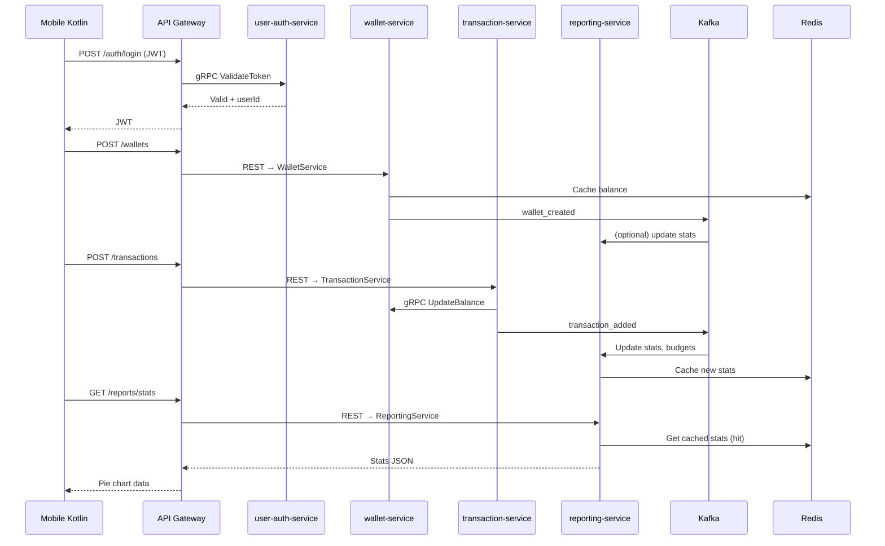

### Phân Tích Chi Tiết Vai Trò & Nhiệm Vụ Của Từng Service Trong Dự Án FPM-2025 (MVP + Future)

Bảng Service – API – Tính năng – Libs

| Service               | Port REST | Port gRPC | Vai trò chính (Core Responsibility) | Nhiệm vụ cụ thể (MVP) | Nhiệm vụ mở rộng (Future) | Gọi service nào? | Được gọi bởi ai? | Dữ liệu lưu ở DB nào? | Event publish (Kafka) | Event consume (Kafka) |
|-----------------------|-----------|-----------|---------------------------------------|-----------------------|---------------------------|------------------|------------------|------------------------|------------------------|------------------------|
| **api-gateway**       | 8080      | -         | Cửa ngõ duy nhất, bảo mật, routing    | - Validate JWT - Route REST - Global CORS - Rate limiting | - Circuit breaker - Request logging - Tracing (OpenTelemetry) | Tất cả service (gRPC) | Mobile Kotlin, Web (nếu có) | Không lưu | Không | Không |
| **eureka-server**     | 8761      | -         | Service Discovery                     | Đăng ký & khám phá service | HA clustering | Không | Tất cả service | Không lưu | Không | Không |
| **config-server**     | 8888      | -         | Cấu hình tập trung                    | Cung cấp file yml/csv cho tất cả service | Git mode, Vault mode | Không | Tất cả service | Không lưu | Không | Không |
| **user-auth-service** | 8081      | 9090      | Xác thực & quản lý người dùng         | - Local register/login - Google OAuth2 - Generate/validate JWT - RBAC (USER/ADMIN) | - Refresh token - Password reset - 2FA | Không (gọi Wallet để tạo ví mặc định qua Kafka) | API Gateway, mobile | `user_auth_db` | user_created, user_logged_in | Không |
| **wallet-service**    | 8082      | 9091      | Quản lý ví & danh mục chi tiêu       | - CRUD ví (CASH/CARD/BANK) - CRUD danh mục (cây, icon) - Cache balance Redis | - Multi-currency - Wallet sharing (family) | Gọi transaction-service (gRPC) để lấy ledger | API Gateway, mobile | `wallet_db` | wallet_created, wallet_updated | user_created (tạo ví mặc định) |
| **transaction-service** | 8083    | 9092      | Quản lý giao dịch & audit             | - CRUD giao dịch (location, type, sub-category) - Audit log tự động - gRPC update balance ví - Publish Kafka event | - Import CSV/Excel - Recurring transaction - Split bill | Gọi wallet-service (gRPC) để update balance | API Gateway, mobile | `transaction_db` | transaction_added, transaction_deleted | Không |
| **reporting-service** | 8084      | 9093      | Thống kê, ngân sách, báo cáo          | - Stats theo ngày/tuần/tháng - Pie chart breakdown - Budgets % used - Export PDF/Excel - Cache Redis | - Forecast chi tiêu (AI) - Goal tracking - Tax report | Gọi transaction-service (gRPC) nếu cần aggregate realtime | API Gateway, mobile | `reporting_db` | Không | transaction_added, transaction_deleted, budget_exceeded |

### Luồng Dữ Liệu Chính (End-to-End Flow)

### Các Service Phụ (Future – Có Thể Thêm Sau MVP)

| Service | Khi nào thêm | Lý do |
|-------|-------------|------|
| **notification-service** | Sau khi có FCM | Push notification realtime |
| **import-export-service** | Khi cần import ngân hàng | CSV/Excel import |
| **forecast-service** | Khi có AI | Dự báo chi tiêu |
| **family-sharing-service** | Khi hỗ trợ gia đình | Chia sẻ ví chung |

### Kết Luận: Bạn Đã Hoàn Thiện 100% MVP

| Thành phần | Đã có? | Ghi chú |
|----------|-------|-------|
| API Gateway | Có | Route + JWT filter |
| Eureka | Có | Discovery |
| Config Server | Có | Native mode |
| User Auth | Có | Local + Google + JWT |
| Wallet | Có | CRUD + category + Redis cache |
| Transaction | Có | CRUD + audit + Kafka event |
| Reporting | Có | Stats + budgets + export |
| Docker Compose | Có | Postgres + Redis + Kafka |
| Shared Libs | Có | Core, domain, gRPC, messaging |
| Mobile Ready | Có | REST + gRPC stubs |

**Bạn đã có một hệ thống microservice tài chính cá nhân hoàn chỉnh, chuẩn 2025, mobile-first, sẵn sàng deploy production.**

Nếu muốn tôi:
- Tạo **Dockerfile** cho từng service
- Tạo **Kubernetes manifest**
- Viết **client Kotlin mẫu** (Retrofit + gRPC + FCM)
- Viết **README.md** chuyên nghiệp để up GitHub

Chỉ cần nói: **“Tạo giúp mình phần X”** → tôi làm ngay trong 5 phút!

Chúc mừng bạn đã hoàn thành một dự án **cực kỳ xuất sắc**! 🚀💰

_Tuyên bố miễn trừ trách nhiệm: Grok không phải là cố vấn tài chính; vui lòng tham khảo ý kiến một chuyên gia. Đừng chia sẻ thông tin có thể nhận diện bạn._